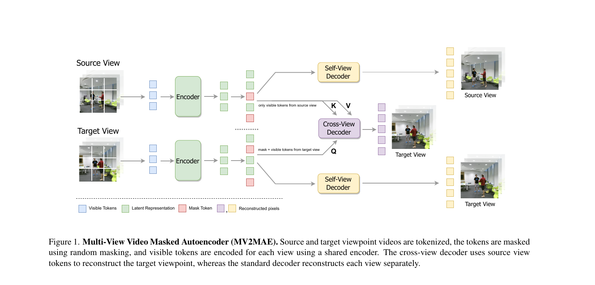

# summary: MV2MAE — Multi-View Video Masked Autoencoders

> Shah et al., arXiv 2401.15900v1, 2024.01.29 (Johns Hopkins University & Amazon)

**멀티뷰 동기화 비디오에서 Cross-View Decoder로 다른 시점의 마스킹된 패치를 복원하도록 학습하여 3D 기하 정보를 자기지도(self-supervised) 방식으로 내재화한다. Motion-Weighted Loss로 정적 배경의 trivial 복원 문제를 해결하며, 행동 인식 벤치마크 NTU-60/120, ETRI에서 비지도 SOTA를 달성한다.**

---

## 1. Introduction

- <u>멀티뷰 비디오</u>는 3D 구조 이해에 유리하지만, 기존 MAE 방법은 단일 시점 위주로 시점 변화에 취약
- **비디오의 정적 영역은 인접 프레임 copy-paste로 trivially 복원 가능 → 의미 있는 표현 학습을 방해**
- 기존 대조학습(ViewCLR 등)은 모델 2벌 + 큐 2개 필요로 메모리 집약적이고 다단계 학습 필요

---

## 2. Related Work

| 범주 | 대표 방법 | 특징 |
|------|----------|------|
| Pretext Learning | Video Jigsaw, Frame Ordering | 이미지 SSL의 비디오 확장 |
| Contrastive Learning | MoCo, ViewCLR | Positive pair 생성, 메모리 집약적 |
| Masked Video Modeling | VideoMAE, MAE-ST | 단일 시점, 정적 영역 trivial 복원 문제 |
| Multi-View 행동 인식 | ViewCon, VPN | 3D pose 의존 또는 별도 뷰 임베딩 필요 |

---

## 3. Method

### Figure 1 — 전체 아키텍처

> Source/Target 뷰 영상을 토크나이즈·마스킹 후 공유 인코더로 인코딩한다. Self-View Decoder는 각 뷰를 스스로 복원하고, **Cross-View Decoder는 source의 visible 토큰(K, V)으로 target의 마스킹 패치(Q)를 복원**하여 두 시점 간 기하 관계를 학습한다.

---

### 3.1 기본 MAE 구조

$$\mathcal{L}_{\text{MAE}} = \frac{1}{\rho N} \sum_{i \in \Omega} |\mathbf{I}_i - \hat{\mathbf{I}}_i|^2$$

> 전체 $N$개 토큰 중 마스킹 비율 $\rho$만큼 가려진 패치들의 집합 $\Omega$에 대해, 원본 픽셀 $\mathbf{I}_i$와 복원 픽셀 $\hat{\mathbf{I}}_i$의 평균 제곱 오차(MSE)를 최소화한다.

---

### 3.2 Cross-View Reconstruction (핵심 기여 1)

- **Source view의 visible 토큰 → K, V**
- **Target view의 masked 토큰 → Q**
- Cross-attention으로 target 마스킹 패치를 복원

$$\hat{\mathbf{I}}^{tv} = \Phi_{\text{dec}}^{\text{cross-view}}\!\left(\mathbf{Z}_c^{tv},\, \mathbf{Z}_{\text{vis}}^{sv}\right)$$

> 타겟 뷰의 인코딩된 특징 $\mathbf{Z}_c^{tv}$가 소스 뷰의 visible 특징 $\mathbf{Z}_{\text{vis}}^{sv}$를 참조(cross-attention)하여 타겟 뷰의 마스킹 영역을 복원한다. **모델이 두 시점 간 3D 기하 관계를 스스로 학습하도록 강제한다.**

---

### 3.3 Motion-Weighted Reconstruction Loss (핵심 기여 2)

$$\mathcal{L} = \frac{1}{\rho N} \sum_{i \in \Omega} w_i \times |\mathbf{I}_i - \hat{\mathbf{I}}_i|^2$$

> 기본 MAE 손실에 **모션 가중치 $w_i$**를 곱한다. 많이 움직인 패치일수록 $w_i$가 크고, 정적 배경 패치일수록 $w_i$가 작아진다. 정적 배경을 단순 copy-paste로 복원하는 지름길을 차단하여 의미 있는 특징 학습을 유도한다.

**모션 가중치 계산:**

$$w_i = \text{softmax}\!\left(\frac{\|f_{\text{diff},i}\|}{t}\right), \quad f_{\text{diff}} = |I_{:,t,:,:} - I_{:,t-1,:,:}|$$

> 인접 프레임 차이 $f_{\text{diff}}$의 L2 노름을 temperature $t$로 나눈 뒤 softmax로 정규화. **$t$가 작을수록 움직이는 패치에 집중, $t$가 클수록 모든 패치를 균등하게 처리.** 실험상 $t=60$이 최적.

---

### 3.4 Implementation Details

| 항목 | 값 |
|------|-----|
| 인코더 | ViT-S/16 (기본), ViT-T / ViT-B 스케일업 가능 |
| 입력 | 16 RGB 프레임, stride=4, 해상도 128×128 |
| 토크나이징 | 시간 patch 2, 공간 patch 16×16 → 512 토큰 |
| 마스킹 비율 $\rho$ | 0.7 (단일뷰 0.9보다 낮음 — 뷰 간 추론에 더 많은 정보 필요) |
| 학습 | AdamW, 1600 epochs |

---

## 4. Experiment

### 4.1 데이터셋

| 데이터셋 | 규모 | 뷰 수 | 용도 |
|---------|------|--------|------|
| NTU RGB+D 60 | 56,880 videos, 60 classes | 3 (Kinect-v2) | 사전학습 + 파인튜닝 |
| NTU RGB+D 120 | 114,480 videos, 120 classes | 3 | 사전학습 + 파인튜닝 |
| ETRI | 112,620 videos, 55 classes | 8 | 사전학습 + 파인튜닝 |
| NUCLA / PKU-MMD-II / ROCOG-v2 | 소규모 | – | 전이학습 평가 |

### 4.2 SOTA 비교 (파인튜닝)

| 데이터셋 | 벤치마크 | MV2MAE | 기존 최고 비지도 | 차이 |
|---------|---------|--------|----------------|------|
| NTU-60 | xview | **95.9%** | 94.1% (ViewCLR) | +1.8%p |
| NTU-60 | xsub | **90.0%** | 89.7% (ViewCLR) | +0.3%p |
| NTU-120 | xsub | **85.3%** | 84.5% (ViewCLR) | +0.8%p |
| ETRI | xsub | **96.5%** | 95.1% (ConViViT, 지도학습) | +1.4%p |

**비지도 방법만으로 지도학습 ETRI SOTA를 능가함**

### 4.3 전이학습 (NTU-60 사전학습 → 소규모 데이터셋)

| 데이터셋 | MV2MAE | 기존 최고 비지도 | 차이 |
|---------|--------|----------------|------|
| NUCLA | **97.6%** | 89.1% (ViewCLR) | **+8.5%p** |
| PKU-MMD-II | **60.1%** | 57.3% (HaLP) | +2.8%p |
| ROCOG-v2 | **89.0%** | 87.0% | +2.0%p |

**전이학습에서 특히 두드러진 성능 차이 → 표현의 범용성(generalizability) 확인**

### 4.4 Ablation Study

| 실험 항목 | 최적값 | 이유 |
|----------|--------|------|
| Temperature $t$ | **60** | 낮으면 동적 영역만, 높으면 정적 배경도 동등 처리 → 성능 저하 |
| 마스킹 비율 $\rho$ | **0.7** | 뷰 간 기하 추론에 더 많은 정보 필요 |
| 소스 뷰 수 | **1개** | 소스 뷰 많을수록 복원 쉬워져 오히려 성능 하락 |
| 뷰 간 거리 | **인접** | 너무 먼 뷰(View1↔View4)는 기하 추론 어려워 성능 저하 |
| 모델 크기 | ViT-T→S→B | 82.0 → 83.4 → 85.1%로 일관된 향상 |

---

## 5. Conclusion

- <u>Cross-View Reconstruction</u> + <u>Motion-Weighted Loss</u> 두 기여로 멀티뷰 비디오 자기지도 학습 SOTA 달성
- **추가 모달리티(depth, pose) 없이 RGB만으로 지도학습 수준 또는 그 이상의 성능**
- ViewCLR 대비 메모리 효율적이고 단일 단계 학습으로 실용성 높음

---

## AIC 프로젝트 연관성

| 이 논문 | AIC 프로젝트 적용 가능성 |
|---------|----------------------|
| 멀티뷰 간 Cross-Attention으로 기하 정보 학습 | 3-view 카메라(left/center/right) 간 관계 학습 |
| Motion-Weighted Loss (움직이는 영역 강조) | 그리퍼/케이블 끝 영역에 가중치 부여한 학습 손실 |
| Self-supervised 사전학습 후 downstream 파인튜닝 | 대량 데이터로 시각 인코더 사전학습 후 삽입 정책 학습 |

> 직접적 연관성은 제한적이나, **멀티뷰 카메라 표현 학습 방법론**으로 참고 가능
