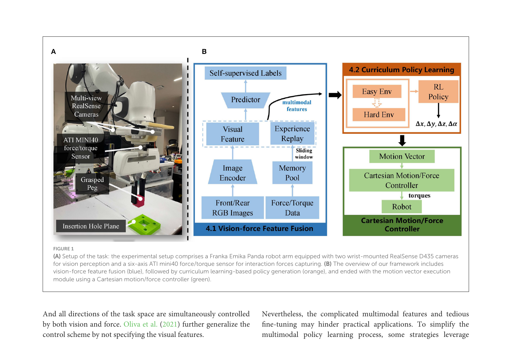
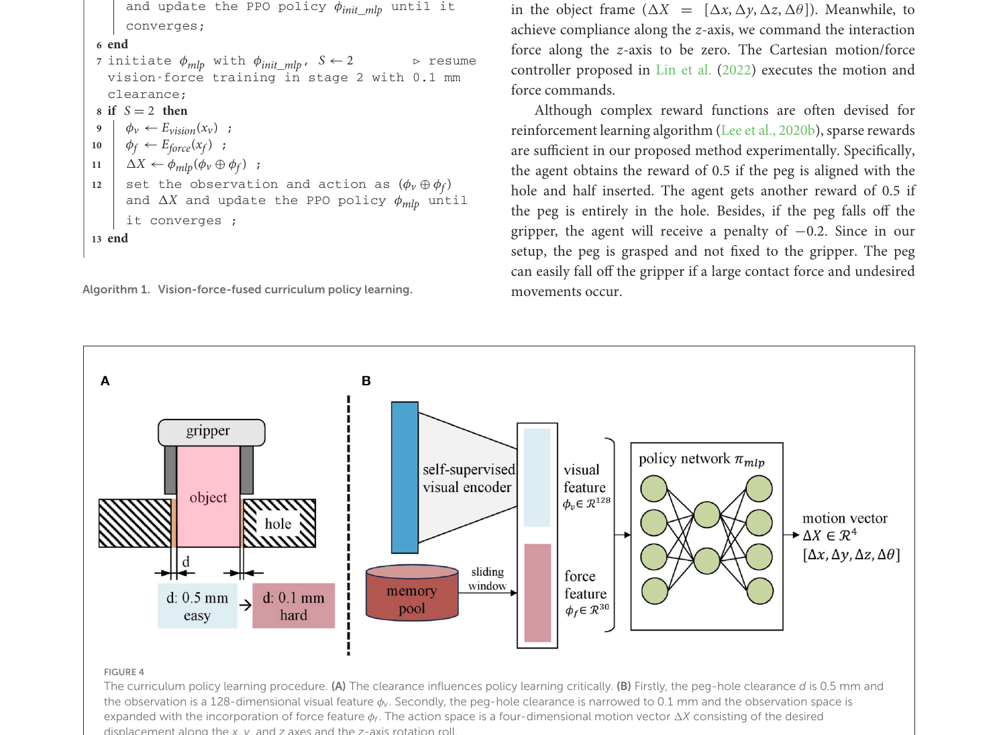

# summary: Vision-force-fused Curriculum Learning for Robotic Contact-rich Assembly Tasks

> Jin et al., Frontiers in Neurobotics 2023. DOI: 10.3389/fnbot.2023.1280773

**비전과 힘 센서를 멀티모달로 융합하고, 쉬운 환경 → 어려운 환경 순서의 Curriculum Learning을 적용하여 0.1 mm 클리어런스 조립 작업에서 95.2% 성공률을 달성한다. 시뮬레이션 학습 후 실물 로봇에 zero-shot 전이가 가능하며, 인간 시연 없이 미학습 형상에도 일반화된다.**

---

## 1. Introduction

- <u>Contact-rich 조립 작업</u>은 정밀 지각·제어·의사결정이 동시에 필요하며, 기존 방식은 비전/힘 중 하나만 활용함
- **두 센서의 상보성(complementarity)을 통합적으로 활용하는 end-to-end 프레임워크가 부재했음**
- 제안: 비전+힘 특징 융합 + Curriculum Learning + Cartesian motion/force controller

---

## 2. Related Work

| 범주 | 방법 | 한계 |
|------|------|------|
| 힘 기반 제어 | 힘/토크 과도응답으로 위치 추정 | 사전 형상 지식 필요, 미학습 형상 취약 |
| 비전 기반 제어 | RGB-D로 삽입 위치 탐색 | 접촉 중 힘 정보 활용 불가 |
| 비전+힘 결합 | Visual servoing + 임피던스 제어 | 각 센서를 분리 컨트롤러에 적용, 상보성 미활용 |
| RL 기반 | 환경 변화 적응성 우수 | 샘플 비효율, 실물 배포 어려움 |

---

## 3. Problem Statement

**태스크**: 직사각형 peg를 hole에 삽입 (클리어런스 ≤ 0.1 mm, 삽입 깊이 10 mm)

$$X_{\text{target}} = X_{\text{cur}} + \Delta X, \quad \Delta X = f(x_v, x_f)$$

> 로봇의 현재 포즈 $X_{\text{cur}}$에 증분 벡터 $\Delta X$를 더해 다음 목표 포즈를 결정한다. $\Delta X$는 비전 관측 $x_v$와 힘 관측 $x_f$를 입력으로 받는 정책 함수 $f$가 출력한다.

- $\Delta X = [\Delta x, \Delta y, \Delta z, \Delta\theta] \in \mathbb{R}^4$: x·y·z 이동량 + z축 회전량
- **접촉 전·후 비전/힘 특성이 크게 달라 단일 정책 함수로 통합이 어렵다** → 모달리티별 인코더로 해결

---

## 4. Method

### Figure 1 — 전체 시스템 개요

> (A) Franka 로봇 + RealSense D435 카메라 2대 + ATI mini40 F/T 센서 구성.
> (B) 비전-힘 특징 융합(파란색) → Curriculum 기반 정책 생성(주황색) → Cartesian motion/force controller 실행(초록색) 파이프라인.

---

### 4.1 Vision-force Feature Fusion

$$\phi_v = E_{\text{vision}}(x_v), \quad \phi_f = E_{\text{force}}(x_f), \quad \Delta X = \pi_{\text{mlp}}(\phi_v \oplus \phi_f)$$

> - $E_{\text{vision}}$: 카메라 이미지 → 128차원 비전 특징 $\phi_v$
> - $E_{\text{force}}$: F/T 센서 데이터 → 30차원 힘 특징 $\phi_f$
> - $\pi_{\text{mlp}}$: 두 특징을 이어붙인($\oplus$) 158차원 벡터를 입력받아 모션 명령 $\Delta X$를 출력하는 MLP 정책

| 인코더 | 입력 | 처리 방식 | 출력 차원 |
|--------|------|-----------|----------|
| $E_{\text{vision}}$ | Front/Rear RGB | ResNet50 → 3-layer MLP (self-supervised) | 128 |
| $E_{\text{force}}$ | 최근 5프레임 F/T | Sliding window → flatten | 30 |

**힘 특징 정규화:**

$$\phi_f = \tanh\!\left(\frac{x_f - \mu_f}{\sigma_f}\right)$$

> 힘 데이터를 평균 $\mu_f$와 표준편차 $\sigma_f$로 정규화한 뒤 tanh를 적용해 $[-1, 1]$ 범위로 압축. 이상치에 강건하고 신경망 학습을 안정화한다.

**비전 인코더 (self-supervised):** peg-hole 간 오차 $(E_x, E_y, E_\theta)$의 부호(양/음)를 시뮬레이션 합성 이미지 60,000장으로 자동 학습. 라벨 수집 비용 없음.

---

### 4.2 Curriculum Policy Learning

### Figure 4 — Curriculum 학습 절차

> (A) 클리어런스가 클수록(쉬울수록) 정책 학습이 용이함.
> (B) Stage 1: 0.5 mm 클리어런스에서 128-dim 비전 특징만으로 학습 → Stage 2: 0.1 mm 클리어런스에서 힘 특징 추가해 158-dim으로 파인튜닝.

| 단계 | <u>클리어런스</u> | 관측 공간 | 역할 |
|------|---------|-----------|------|
| Stage 1 (Easy) | **0.5 mm** | $\phi_v$ 128-dim | 비전 기반 대략적 정렬 학습 |
| Stage 2 (Hard) | **0.1 mm** | $\phi_v \oplus \phi_f$ 158-dim | 힘 피드백으로 정밀 삽입 파인튜닝 |

- Stage 1의 학습된 정책 $\phi_{\text{init\_mlp}}$를 Stage 2 초기값으로 재사용 → Stage 2가 "전역 비전 정책을 힘으로 로컬 정밀화"하는 형태
- RL 알고리즘: <u>PPO (Proximal Policy Optimization)</u>

**Sparse Reward 설계:**

$$r = \begin{cases} +0.5 & \text{peg가 hole에 절반 삽입} \\ +0.5 & \text{peg가 hole에 완전 삽입} \\ -0.2 & \text{peg가 그리퍼에서 낙하} \end{cases}$$

> 복잡한 보상 함수 없이 세 가지 희소 보상만으로 충분. 낙하 패널티(-0.2)는 지나친 접촉력을 억제한다.

---

### 4.3 Implementation Details

| 항목 | 값 |
|------|-----|
| 시뮬레이터 | MuJoCo |
| 비전 학습 데이터 | 합성 RGB 60,000장 |
| 포즈 랜덤화 | x·y ±10 mm, z 5~20 mm, 회전 ±10° |
| Domain Randomization | Gaussian blur, white noise, random shadow, random crop, 색상 랜덤화 |
| PPO 설정 | n\_steps=64, batch\_size=32, gae\_lambda=0.998 |

---

## 5. Experiment

### 5.1 기존 방법 대비 비교 (Table 1)

| 모델 | 클리어런스 | 성공률 | 형상 일반화 | 인간 시연 |
|------|-----------|--------|------------|----------|
| Gao & Tedrake (2021) | 0.2 mm | 74% | ✗ | ✗ |
| Lee et al. (2020b) | 2 mm | 78% | ✓ | ✗ |
| Spector et al. (2022) | – | 97.5% | ✗ | ✓ |
| **Ours** | **0.1 mm** | **95.2%** | **✓** | **✗** |

### 5.2 일반화 성능 (RQ2)

| 형상 | 성공률 | 비고 |
|------|--------|------|
| Square (학습 대상) | 95.3% | 기준 |
| Pentagon | 86% | 형상 유사도 높음 |
| Triangle | 68% | z축 회전 요구량 높음 |
| Circle | 60% | 선 접촉으로 슬립 발생 |

### 5.3 Ablation Study (RQ3)

| 모델 | 성공률 | 설명 |
|------|--------|------|
| Naive RL | **0%** | CL 없이 0.1 mm에서 수렴 불가 |
| Vision-only CL | 70% | CL만으로 기본 작동 |
| **Vision-force CL (Ours)** | **95.2%** | 힘 융합으로 +25%p |

**CL이 없으면 극정밀 태스크에서 RL이 아예 수렴하지 못함 — CL이 학습 가능성 자체를 결정한다.**

### 5.4 실물 실험 (RQ4, Table 2)

| 모델 | Square | Pentagon | Triangle | Circle |
|------|--------|----------|----------|--------|
| Vision-only CL | 3/10 | 8/10 | 3/10 | 2/10 |
| **Vision-force CL** | **6/10** | **9/10** | **5/10** | **4/10** |

- **시뮬레이션 → 실물 zero-shot 전이 성공**, 성능 격차가 실물에서도 동일하게 유지

---

## 6. Conclusion

- <u>비전-힘 융합</u> + <u>Curriculum Learning</u> 두 기여로 contact-rich 조립 SOTA 달성
- **비전은 전역 방향 탐색, 힘은 접촉 후 정밀 보정 역할 — 두 모달리티가 서로 다른 단계를 담당**
- 인간 시연 불필요, 미학습 형상 일반화, zero-shot 실물 전이 모두 달성

---

## AIC 프로젝트 연관성

| 이 논문 | 우리 프로젝트 |
|---------|--------------|
| Peg-in-hole, 0.1 mm clearance | 케이블(SFP/SC) 포트 삽입 |
| 비전(RGB) + F/T 센서 융합 | 3-view 카메라 + tcp\_error (controller\_state) |
| Curriculum Learning (쉬운 → 어려운 환경) | 현재 단일 난이도 ACT 모방학습 |
| Self-supervised visual encoder | YOLO 기반 포트 검출 |
| PPO 기반 RL | Behavior Cloning (ACT) |

**참고할 핵심 아이디어**: force feature를 별도 인코딩하고, 데이터 수집 시 perturbation 크기를 점진적으로 줄이는 Curriculum 방식 도입하면 성능 향상 여지 있음.
