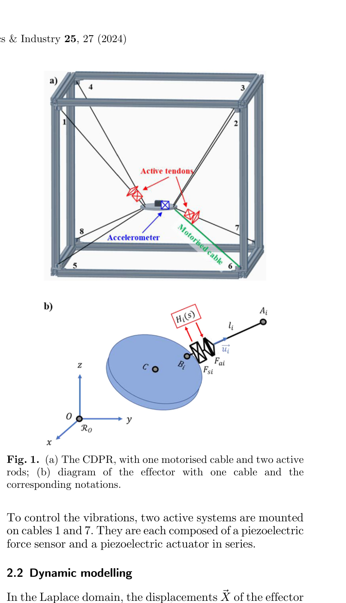
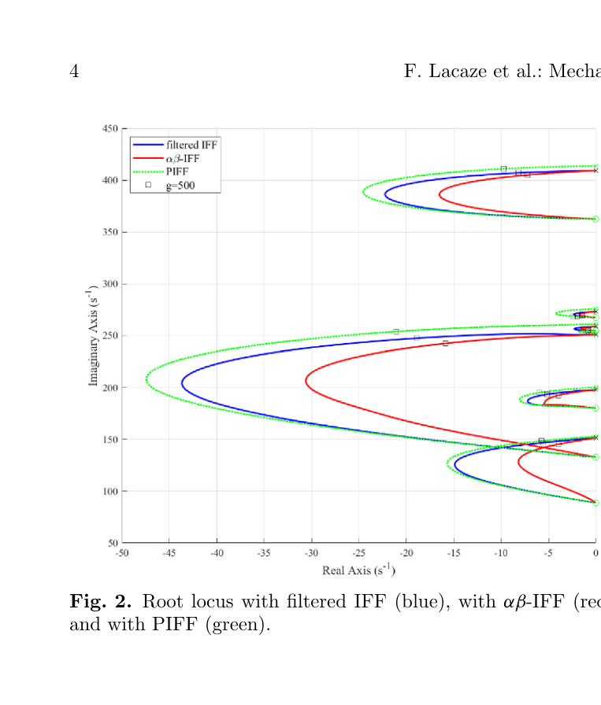
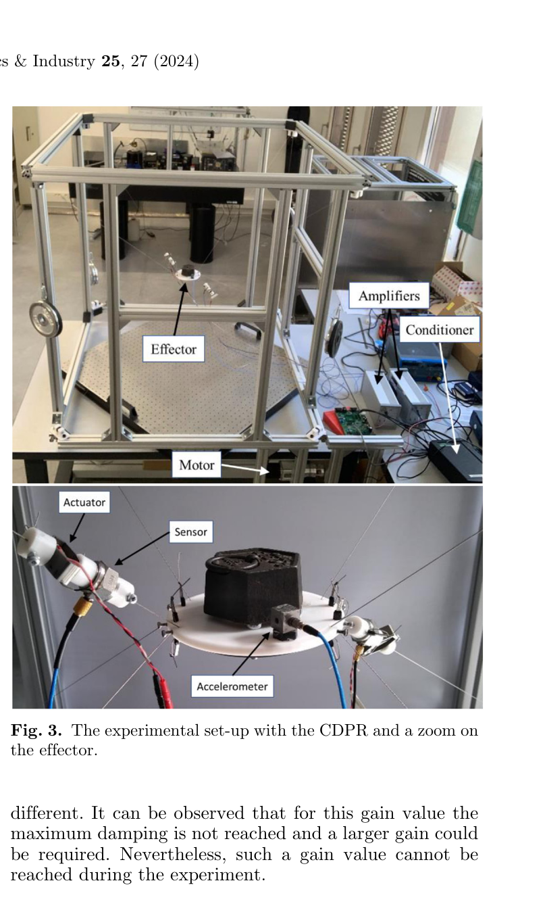
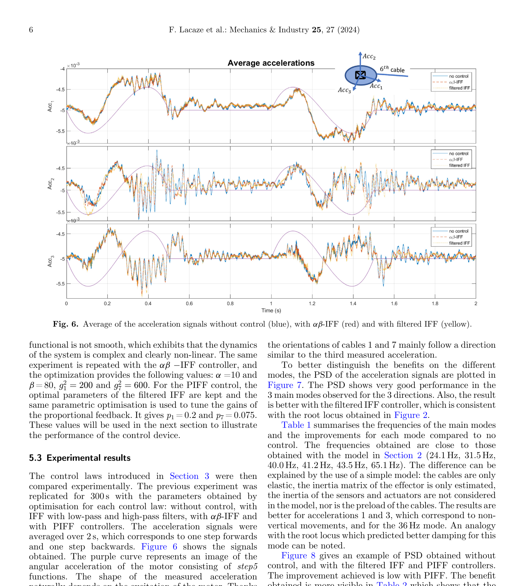
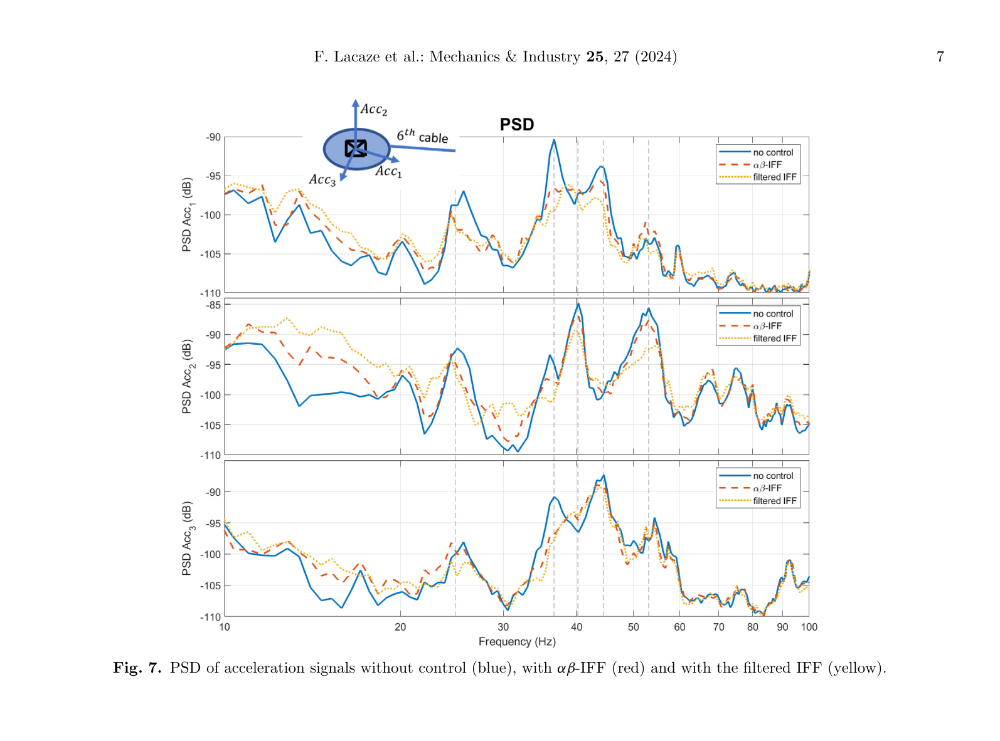

# summary: Active Vibration Control of a Cable-Driven Parallel Robot Using Active Rods

> Lacaze et al., Mechanics & Industry 25, 27 (2024). DOI: 10.1051/meca/2024024

**8개 케이블로 구동되는 CDPR(Cable-Driven Parallel Robot)에 2개의 <u>압전 능동 로드(active rods)</u>를 장착하여 이펙터의 진동을 능동 제어한 논문. 세 가지 제어 법칙($\alpha\beta$-IFF, Filtered IFF, PIFF)을 제안/비교하며, 파라메트릭 최적화를 통해 6개 주요 모드 전체에서 진동 감소를 달성. PIFF가 가장 우수한 감쇠 성능을 보임.**

---

## 1. Introduction

- **CDPR**: 케이블로 고정 베이스와 이동 플랫폼(이펙터)을 연결하는 병렬 로봇. 넓은 작업 공간, 빠른 가속 가능
- 문제: 케이블의 **낮은 강성과 감쇠**로 인해 이펙터 동작 시 기생 진동 발생
- 기존 접근: 내부 힘 증가, Input Shaping, 퍼지 제어, 리액션 휠, 능동 안정기 등
- 본 논문 접근: **압전 트랜스듀서**로 구성된 능동 로드를 케이블에 직렬 배치 → <u>Integral Force Feedback (IFF)</u> 기반 제어
- IFF 장점: 시스템 사전 지식 불필요, 무조건 안정(센서-액추에이터 공배치 시)
- IFF 한계: 저주파 컴플라이언스 저하, 센서 드리프트 → 개선된 $\alpha\beta$-IFF 및 PIFF 제안

---

## 2. Method

### Figure 1 — CDPR 아키텍처 및 능동 로드 구성

> (a) 1m 정육면체 프레임의 CDPR. 8개 케이블 중 **케이블 1, 7에 능동 로드(Active tendons)** 장착. 이펙터에 가속도계(Accelerometer), 모터로 케이블 구동. (b) 이펙터 다이어그램: 케이블 장력 $T_i$, 능동 힘 $F_{ai}$, 센서 힘 $F_{si}$의 관계.

---

### 동역학 모델

라플라스 영역에서 이펙터의 변위:

$$Ms^2\vec{X}(s) = J_u\vec{T}(s) + \vec{F}(s)$$

> - $M$: 질량 행렬 (이펙터 질량 + 관성)
> - $\vec{X}(s)$: 이펙터 6자유도 변위
> - $J_u$: 야코비안 행렬 (케이블 장력 → 이펙터 힘/모멘트 매핑)
> - $\vec{T}(s)$: 케이블 장력 벡터
> - $\vec{F}(s)$: 외란 힘

능동 로드의 변위 $\Delta_i$는 압전 액추에이터의 특성에 의해 결정:

$$F_{ai}(s) = H_i^j(s) \cdot F_{si}(s)$$

> - $F_{ai}$: 능동 힘 (액추에이터 출력)
> - $F_{si}$: 센서 측정 힘 (압전 힘 센서)
> - $H_i^j(s)$: 제어 법칙 전달 함수

---

### 세 가지 제어 법칙

| 제어 법칙 | 전달 함수 | 특징 |
|---------|---------|------|
| **Filtered IFF** | $H_i^1(s) = g_i^1 \frac{\omega_{LP}}{(s + \omega_{LP})(s + \omega_{HP})}$ | 고역/저역 필터 추가. 드리프트 방지, 고주파 노이즈 차단 |
| **$\alpha\beta$-IFF** | $H_i^2(s) = g_i^2 \frac{s + \alpha}{(s + \beta)^2}$ | 이중 실수 극점 추가로 필터 불필요. **무조건 안정성 보장** |
| **PIFF** | $H_i^3(s) = g_i^1 \frac{\omega_{LP}}{(s + \omega_{LP})(s + \omega_{HP})} - p_i$ | Filtered IFF + **양의 비례 피드백** 추가. 감쇠 성능 향상 |

> - $g$: 피드백 게인
> - $\omega_{LP}, \omega_{HP}$: 저역/고역 차단 주파수
> - $\alpha, \beta$: $\alpha\beta$-IFF의 영점과 극점 위치
> - $p_i$: 비례 피드백 게인 ($p < 0.4$에서 안정)

### Figure 2 — Root Locus 비교

> 세 제어 법칙의 Root Locus. 파랑: Filtered IFF, 빨강: $\alpha\beta$-IFF, 초록: PIFF. 6개 모드 모두 안정 영역에 위치. 3차 모드(40 Hz)에서 감쇠가 가장 크며, Filtered IFF가 전반적으로 높은 감쇠를 보이지만 **PIFF가 모든 모드에서 약간 더 우수**.

---

## 3. Experiment

### Figure 3 — 실험 셋업

> 실험 장치 전경. 8개 케이블이 연결된 CDPR, 이펙터에 장착된 가속도계, 능동 로드의 센서와 액추에이터, 앰프와 컨디셔너. DSpace DS1104로 실시간 제어.

### 파라메트릭 최적화

최적화 절차:
1. 필터 주파수 최적화: $\omega_{LP} = 2\pi \times 300$ rad/s, $\omega_{HP} = 2\pi \times 20$ rad/s
2. 게인 최적화: $g_1^1 = 400$, $g_7^1 = 800$
3. $\alpha\beta$-IFF: $\alpha = 10$, $\beta = 80$, $g_1^2 = 200$, $g_7^2 = 600$
4. PIFF: $p_1 = 0.2$, $p_7 = 0.075$

### Figure 6 — 가속도 신호 비교 (시간 영역)

> 제어 없음(파랑), $\alpha\beta$-IFF(빨강), Filtered IFF(노랑) 비교. 세 축(Acc₁, Acc₂, Acc₃) 모두에서 능동 제어 시 진동 진폭이 감소. 보라색 곡선은 모터 각가속도(step5 함수).

### Figure 7 — PSD 비교 (주파수 영역)

> 3축 가속도의 Power Spectral Density. 주요 모드(25, 36, 40, 44, 53, 54 Hz)에서 제어 법칙 적용 시 에너지 감소. Filtered IFF(노랑)가 대부분의 모드에서 더 큰 감쇠를 보임.

### 정량 결과

**Table 1: 모드별 진동 감소 (dB)**

| 가속도 | 주파수 (Hz) | $\alpha\beta$-IFF (dB) | Filtered IFF (dB) |
|--------|-----------|---------------------|-------------------|
| Acc₁ | 25 | 2.5 | 3.1 |
| Acc₁ | **36** | **6.2** | **5.8** |
| Acc₁ | 44 | 1.9 | 4.1 |
| Acc₂ | 25 | 0.9 | 1.8 |
| Acc₂ | 40 | 2.1 | 4.5 |
| Acc₂ | 53 | 2.1 | 6.3 |
| Acc₃ | 36 | 6.1 | 7 |
| Acc₃ | 44 | 1.7 | 2 |
| Acc₃ | 54 | 0.8 | 1.5 |

**Table 2: 전체 RMS 값 비교**

| 제어 법칙 | Acc₁ | Acc₂ | Acc₃ | ‖Acc‖ |
|---------|------|------|------|-------|
| Control off | 1.07e-4 | 2.11e-4 | 1.49e-4 | 1.64e-4 |
| $\alpha\beta$-IFF | 9.78e-5 | 2.01e-4 | 1.42e-4 | 1.53e-4 |
| Filtered IFF | 9.42e-5 | 1.98e-4 | 1.37e-4 | 1.48e-4 |
| **PIFF** | **9.36e-5** | **1.76e-4** | **1.35e-4** | **1.37e-4** |

> **PIFF가 모든 축에서 가장 낮은 RMS 값** → 가장 우수한 종합 진동 감쇠 성능

---

## 4. Conclusion

- 8개 케이블 CDPR에 **2개의 능동 로드**만으로 **6개 주요 모드 전체**의 진동 감소 달성
- **PIFF 제어 법칙**이 가장 우수한 감쇠 성능 (전체 RMS 16.5% 감소)
- $\alpha\beta$-IFF는 낮은 전력 소비로 전력 제한 환경에서 유리
- 제한사항: 액추에이터 포화, 1축 운동만 테스트
- 향후: 8모터 전축 구동, 더 강력한 액추에이터로 성능 향상 예정

---

## AIC 프로젝트 연관성

| 이 논문 | 우리 프로젝트 적용 가능성 |
|---------|----------------------|
| 케이블 장력 기반 진동 감쇠 | 케이블 삽입 시 케이블 장력을 측정/제어하여 흔들림 억제 |
| 압전 힘 센서 → IFF | 힘/토크 센서 피드백으로 실시간 진동 억제 가능 |
| 2개 능동 소자로 6모드 제어 | 최소한의 센서/액추에이터로도 효과적 진동 제어 가능 → 비용 효율적 |
| PIFF (비례 + 적분 힘 피드백) | 로봇팔 관절 토크에 PIFF 적용하여 케이블 흔들림 감쇠 |
| 파라메트릭 최적화 | RL의 reward에 진동 RMS를 포함시켜 자동 파라미터 최적화 가능 |

> **참고할 핵심 아이디어**: 케이블 삽입 작업에서 힘 센서 피드백 기반의 IFF 제어를 로봇팔 관절 레벨에 적용하여 케이블 흔들림을 실시간 감쇠. 특히 PIFF의 비례 항 추가 아이디어는 RL 정책의 action에 진동 감쇠 보상 항을 추가하는 것과 유사한 접근으로, RL reward 설계에 참고할 수 있음.
