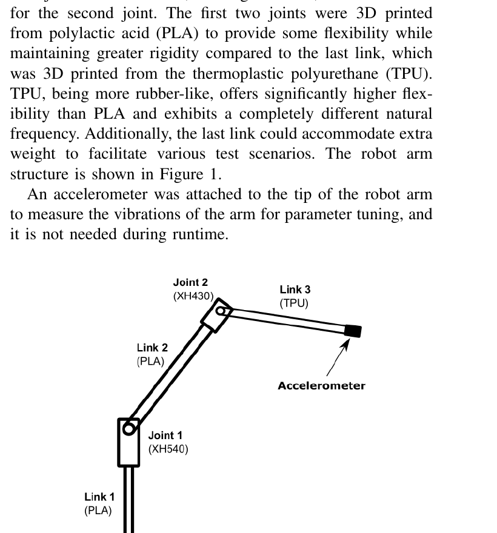
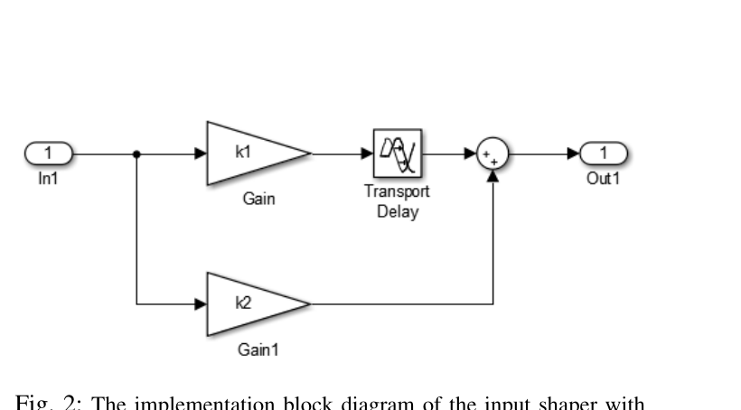
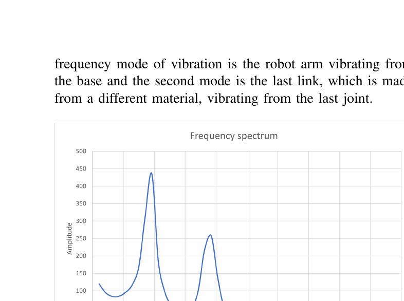
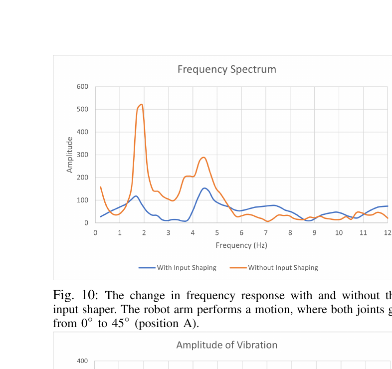
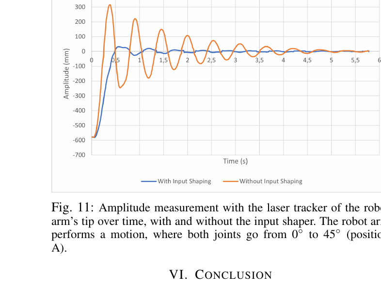

# summary: Data Driven Approach to Input Shaping for Vibration Suppression in a Flexible Robot Arm

> Kotaniemi et al., arXiv 2025. arXiv:2506.14405

**유연한 로봇팔의 잔류 진동을 억제하기 위해 <u>데이터 기반 Input Shaping</u> 기법을 제안한 논문. 3D 프린팅된 유연 로봇팔에서 가속도 센서 데이터로부터 고유 진동수를 추출하고, 작업 공간 내 위치별로 파라미터를 보간(interpolation)하여 적응적으로 Input Shaper를 튜닝한다. 최대 97%의 진동 감소를 달성.**

---

## 1. Introduction

- 로봇팔의 동작 후 발생하는 **잔류 진동(residual vibration)** 은 정확도 저하, 수명 감소, 구조 무결성 손상을 유발
- 특히 **소프트 로봇**은 강성이 낮아 진동이 더 크며, 경량화/유연화 추세에 따라 진동 제어의 중요성 증가
- <u>Input Shaping</u>: 모터 입력 신호를 사전 성형하여 구조물의 고유 진동수와 **상쇄 간섭(destructive interference)** 을 일으켜 진동을 억제하는 **순수 피드포워드(feed-forward)** 기법
- 기존 모델 기반 Input Shaping은 **비선형 동역학**을 가진 유연 로봇에 부적합 → **데이터 기반 접근** 필요

---

## 2. Method

### Figure 1 — 로봇팔 구조

> 3D 프린팅된 유연 로봇팔. Joint 1(XH540)과 Joint 2(XH430) 두 개의 Dynamixel 서보로 구동. Link 1, 2는 PLA(강성), Link 3은 TPU(유연)로 제작. 끝단에 가속도계(Accelerometer) 부착.

---

### Input Shaping 원리

시스템 응답 $y(t)$는 원하는 동작 $y_1(t)$과 불필요한 진동 $y_2(t)$로 구성:

$$y(t) = y_1(t) + y_2(t)$$

> $y_1(t)$: 의도한 로봇 동작, $y_2(t)$: 제거하고 싶은 잔류 진동 성분

진동 주기 $T$의 반주기 $T_0 = T/2$만큼 지연된 신호를 원래 신호와 합성하면 진동 성분이 **상쇄**됨:

$$v(t) = \frac{k_0}{1 + k_0} \cdot u(t - T/2) + \frac{1}{1 + k_0} \cdot u(t)$$

> - $u(t)$: 원래 모터 입력 신호
> - $k_0$: 감쇠 계수 (약감쇠 시스템에서 $k_0 \approx 1$)
> - $T/2$: 고유 진동 반주기 (= Input Shaper의 시간 지연)
> - 핵심: 원래 신호와 반주기 지연 신호의 **가중 합**으로 진동을 상쇄

### Figure 2 — Input Shaper 블록 다이어그램

> Input Shaper의 구현 블록도. 입력 신호를 두 경로로 분기: (1) 직접 경로($k_2$ 게인), (2) Transport Delay($T/2$) + $k_1$ 게인 경로. 두 경로의 출력을 합산하여 진동이 억제된 명령 신호 생성.

---

### 데이터 기반 파라미터 튜닝 절차

| 단계 | 내용 |
|------|------|
| 1 | 작업 공간 내 **주요 위치(key positions)** 선정 |
| 2 | 각 위치에서 동작 후 **가속도 데이터** 수집 |
| 3 | FFT(푸리에 변환)로 **주파수 스펙트럼** 생성 |
| 4 | 스펙트럼에서 **피크 주파수** 추출 |
| 5 | 주파수를 관절 위치에 **매핑(mapping)** |
| 6 | 새로운 위치로 이동 시 주파수를 **선형 보간(interpolation)** 하여 Input Shaper 파라미터 업데이트 |

> **핵심**: 모델링 없이 실측 데이터만으로 위치별 고유 진동수 맵을 구축하고, 실시간으로 보간하여 적응적 진동 억제

---

## 3. Experiment

### Figure 6 — 주파수 스펙트럼 (두 진동 모드)

> Position A(45°, 45°)에서의 주파수 스펙트럼. **1.9 Hz (1차 모드)** 와 **3.8 Hz (2차 모드)** 두 개의 명확한 진동 모드가 관측됨. 1차 모드는 베이스로부터의 팔 전체 진동, 2차 모드는 TPU 링크의 국소 진동.

### Figure 10 — Input Shaping 적용 전후 주파수 비교

> Input Shaping 적용 전(주황)과 후(파랑)의 주파수 응답 비교. 두 진동 모드 모두에서 큰 피크 감소가 관측됨.

### Figure 11 — 진폭 비교 (시간 영역)

> 레이저 트래커로 측정한 로봇팔 끝단의 진폭. Input Shaping 없이(주황)는 큰 진동이 지속되나, Input Shaping 적용 시(파랑) 진동이 급격히 감소.

### 정량 결과

| Position | IS 미적용 진폭 | IS 적용 진폭 | **감소율** |
|----------|-------------|----------|---------|
| A (45°, 45°) | 304 mm | 29.8 mm | **90.2%** |
| B (15°, 15°) | 387 mm | 11.1 mm | **97.1%** |
| C (75°, 60°) | 218 mm | 36.4 mm | **83.3%** |

---

## 4. Conclusion

- 데이터 기반 Input Shaper 파라미터 튜닝으로 **모델 없이도** 유연 로봇팔의 진동을 최대 **97% 억제**
- 순수 **피드포워드** 방식이므로 런타임에 센서가 불필요 (파라미터 튜닝 단계에서만 가속도계 사용)
- 다양한 소재(PLA, TPU)의 3D 프린팅 로봇팔에서 검증
- 향후 연구: 더 많은 자유도, 3차원 동작, 실시간 파라미터 업데이트로 확장 예정

---

## AIC 프로젝트 연관성

| 이 논문 | 우리 프로젝트 적용 가능성 |
|---------|----------------------|
| 데이터 기반 고유 진동수 추출 | 케이블의 흔들림 주파수를 IMU/가속도계로 측정하여 진동 특성 파악 가능 |
| Input Shaping (피드포워드) | 로봇팔 동작 명령을 사전 성형하여 케이블 흔들림을 사전에 억제 |
| 위치별 파라미터 보간 | 케이블 삽입 작업 공간 내 위치에 따라 달라지는 케이블 진동 특성에 적응적 대응 |
| 모델 불필요 | 케이블의 복잡한 동역학 모델링 없이 실측 데이터만으로 적용 가능 |
| 피드포워드 → RL과 결합 | Input Shaping을 기본 진동 억제로 사용하고, RL로 미세 조정하는 **계층적 제어** 가능 |

> **참고할 핵심 아이디어**: 케이블 삽입 시 로봇팔 동작으로 인한 케이블 흔들림을 Input Shaping으로 사전 억제하되, 위치별 진동 특성 맵을 데이터 기반으로 구축하여 적응적으로 대응. RL 정책의 action에 Input Shaper를 전처리 레이어로 추가하면, 정책이 진동을 고려한 학습 부담을 줄일 수 있음.
