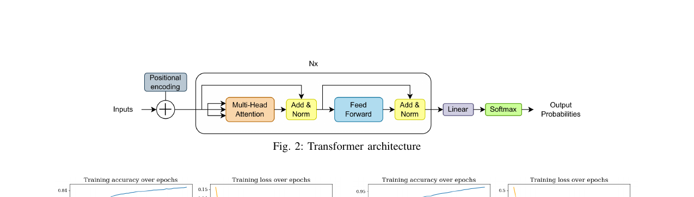
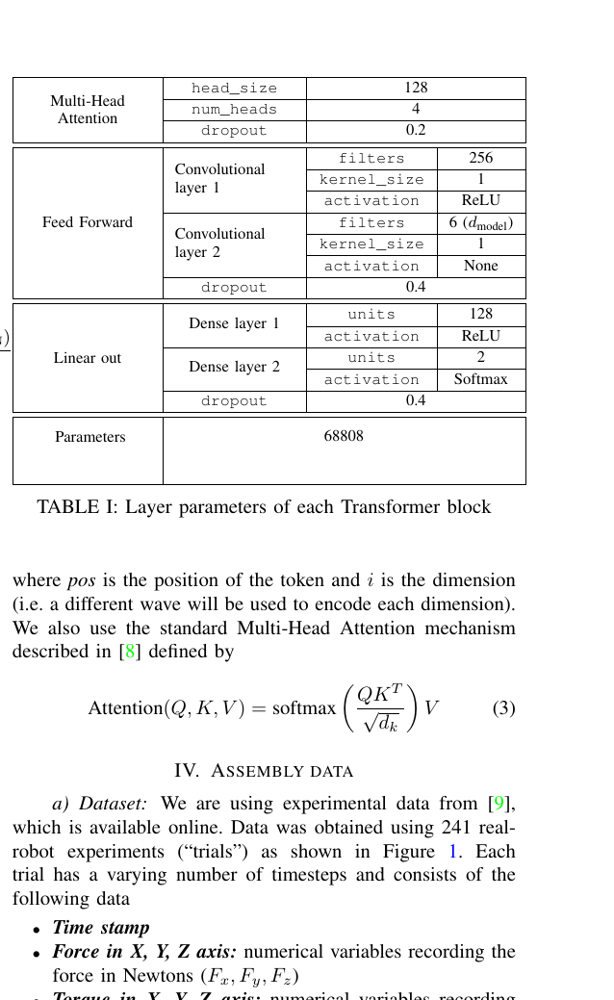
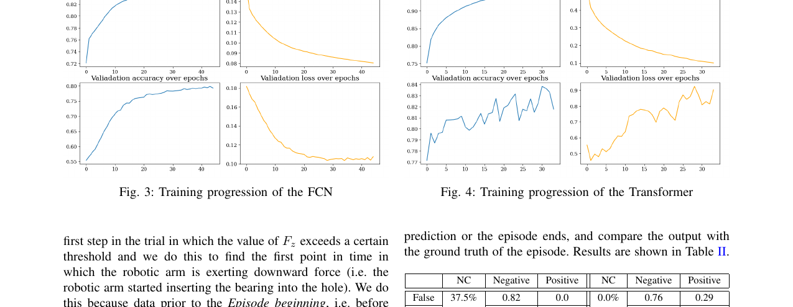
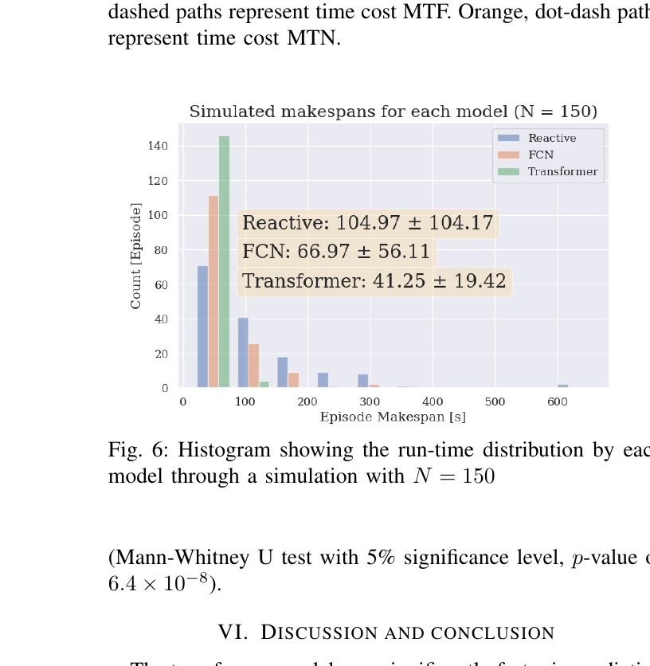

# summary: Early Failure Prediction During Robotic Assembly Using Transformers

> Montané-Güell, Watson, Correll. RSS 2023 Workshop on Robotic Assembly. (Watson & Correll 2023 후속)

**F/T 센서 시계열 데이터에 Transformer를 적용하여 삽입 실패를 조기 예측하고, preemptive restart 정책과 결합해 makespan을 최대 60% 단축한다. Dilated FCN보다 3배 빠른 시점에 예측하며, 시뮬레이션(N=150) 기준 평균 makespan을 104.97s → 41.25s로 줄였다.**

---

## 1. Introduction

### 문제 설정

- Peg-in-hole 조립(케이블 삽입 포함)은 **정밀 부품이 홀에 정렬되지 않으면 여러 번 재시도** 필요
- 기존 접근: 실패가 확정된 후 재시작 (**Reactive policy**)
- 이 논문의 핵심: **실패가 예상될 때 즉시 재시작** → 전체 작업 시간 단축

### 선행 논문과의 관계

| 논문 | 기여 |
|------|------|
| Watson & Correll (2023) [arXiv:2301.10846] | MDP + Dilated FCN으로 preemptive restart 이론 정립 |
| **이 논문 (2023)** | **Transformer로 예측 속도 3배 향상 → makespan 추가 40% 단축** |

---

## 2. Method

### 2-1. Transformer 아키텍처

### Figure 1 — Transformer 구조도

> Positional Encoding → Multi-Head Attention → Add & Norm → Feed Forward → Add & Norm → Linear → Softmax 로 구성된 표준 Transformer 인코더. 출력은 성공/실패 이진 확률.

### Table 1 — 레이어 파라미터

| 블록 | 파라미터 | 값 |
|------|---------|---|
| Multi-Head Attention | head_size | 128 |
| | num_heads | 4 |
| | dropout | 0.2 |
| Feed Forward | Conv layer 1 filters | 256 |
| | Conv layer 2 filters | 6 ($d_{model}$) |
| | dropout | 0.4 |
| Linear out | Dense layer 1 units | 128 (ReLU) |
| | Dense layer 2 units | 2 (Softmax) |
| **총 파라미터** | | **68,808** |

---

### 2-2. Positional Encoding

시계열 순서 정보를 주입하는 sinusoidal 인코딩:

$$PE_{(pos,2i)} = \sin\left(\frac{pos}{10000^{2i/d_{model}}}\right)$$

$$PE_{(pos,2i+1)} = \cos\left(\frac{pos}{10000^{2i/d_{model}}}\right)$$

> $pos$는 시퀀스 내 타임스텝 위치, $i$는 차원 인덱스. 각 차원마다 다른 주파수의 파동을 사용해 순서 정보를 인코딩한다.

---

### 2-3. Attention 메커니즘

$$\text{Attention}(Q, K, V) = \text{softmax}\left(\frac{QK^T}{\sqrt{d_k}}\right)V$$

> $Q$(Query), $K$(Key), $V$(Value) 행렬의 내적으로 각 타임스텝이 다른 타임스텝에 얼마나 "주목"할지를 계산. $\sqrt{d_k}$로 스케일링하여 그래디언트 소실 방지.

---

### 2-4. Makespan 공식 (선행 논문 계승)

$$t_{slow} = \frac{1 + MTF(P_{PP} + P_{PN}) + MTS(P_{NP} + P_{NN}) + MTN(P_{NP} + P_{NN})}{1 - P_{NP} - P_{NN}}$$

| 기호 | 의미 |
|------|------|
| $MTF$ | Mean Time to Failure (실패 확정까지 평균 시간) |
| $MTS$ | Mean Time to Success (성공까지 평균 시간) |
| $MTN$ | Mean Time to give up & restart |
| $P_{PP}$ | 실패 → Positive 예측 (True Positive) |
| $P_{NN}$ | 성공 → Negative 예측 (True Negative) |

> Confusion matrix만 알면 preemptive restart 정책이 실제로 시간을 줄이는지 수학적으로 계산 가능. Transformer의 confusion matrix를 대입하면 FCN보다 더 낮은 $t_{slow}$가 나온다.

---

### 2-5. 데이터셋

- 출처: Watson & Correll (2023) 데이터셋 (공개)
- **241회** 실제 로봇 peg-in-hole 실험
- 각 에피소드 입력: 타임스텝 × 6개 피처
  - Force: $F_x, F_y, F_z$ (Newton)
  - Torque: $T_x, T_y, T_z$ (Newton·meter)
- 클래스 비율: 성공 49.70% / 실패 50.30% (균형)
- **Episode beginning**: $F_z$가 임계값 초과하는 첫 스텝 → 데이터 시작 기준

---

## 3. Experiment

### Figure 2 — FCN vs Transformer 학습 곡선 + Confusion Matrix

> 좌: FCN 학습 곡선 (val accuracy ~80%), 우: Transformer 학습 곡선 (val accuracy ~84%).
> Transformer는 FCN보다 적은 에포크에서 빠르게 수렴하나, validation loss가 다소 불안정함.

**Confusion Matrix 비교:**

| | FCN | Transformer |
|--|-----|------------|
| True Positive (실패→Positive) | 0.82 | 0.76 |
| False Positive (성공→Positive) | 0.0 | 0.29 |
| **특징** | 정확도 높음, 느린 예측 | FP 증가, **3배 빠른 예측** |

> Transformer는 FP율이 높아 정확도는 소폭 낮지만, **훨씬 이른 시점에 실패를 예측**하기 때문에 makespan 단축 효과가 더 크다.

---

### Figure 3 — Makespan 히스토그램 (핵심 결과)

> N=150 시뮬레이션. Transformer(녹색)는 분포가 좌측으로 집중되어 짧은 makespan에 몰려 있음.

| 정책 | 평균 Makespan | 표준편차 |
|------|-------------|---------|
| Reactive (재시작 없음) | 104.97s | ±104.17 |
| FCN + Preemptive | 66.97s | ±56.11 |
| **Transformer + Preemptive** | **41.25s** | **±19.42** |

- **Reactive 대비 60% 단축**, FCN 대비 38% 추가 단축
- 표준편차도 크게 감소 → **작업 시간 예측 가능성(predictability)** 향상
- Mann-Whitney U test: $p = 6.4 \times 10^{-8}$ (통계적으로 유의)

---

## 4. Conclusion

- Transformer는 Dilated FCN보다 **3배 빠른 시점**에 실패를 예측
- FP율이 높아 정확도는 소폭 낮지만, 조기 예측의 이득이 FP 페널티를 압도
- Makespan 기준으로 Transformer + Preemptive restart가 **가장 효율적**
- 향후: 이미지·거리 데이터 등 **다중 모달 입력**으로 확장 예정

---

## AIC 프로젝트 연관성

| 이 논문 | 우리 프로젝트 적용 가능성 |
|---------|----------------------|
| F/T 시계열 → Transformer 이진 분류 | 케이블 삽입 중 힘 데이터로 실패 여부 실시간 판단 |
| 3배 빠른 조기 예측 | 삽입 초반에 실패 감지 → 불필요한 삽입 시간 제거 |
| Makespan 60% 단축 | 경쟁 환경에서 전체 작업 시간 최소화에 직결 |
| 표준편차 감소 (예측 가능성 향상) | 반복 시도의 시간 분산을 줄여 안정적 성능 확보 |
| 68K 파라미터 경량 모델 | 실시간 추론에 적합, 엣지 디바이스 배포 가능 |

> **참고할 핵심 아이디어**: 케이블 삽입 시 $F_x, F_y, F_z, T_x, T_y, T_z$ 6채널 시계열을 Transformer에 입력하여 삽입 초반부터 실패를 예측하고, preemptive restart 정책을 결합하면 전체 삽입 시도 시간을 최대 60%까지 단축할 수 있다. Watson & Correll (2023)의 makespan 공식으로 실제 이득이 있는지 사전에 검증하고 적용할 것.
