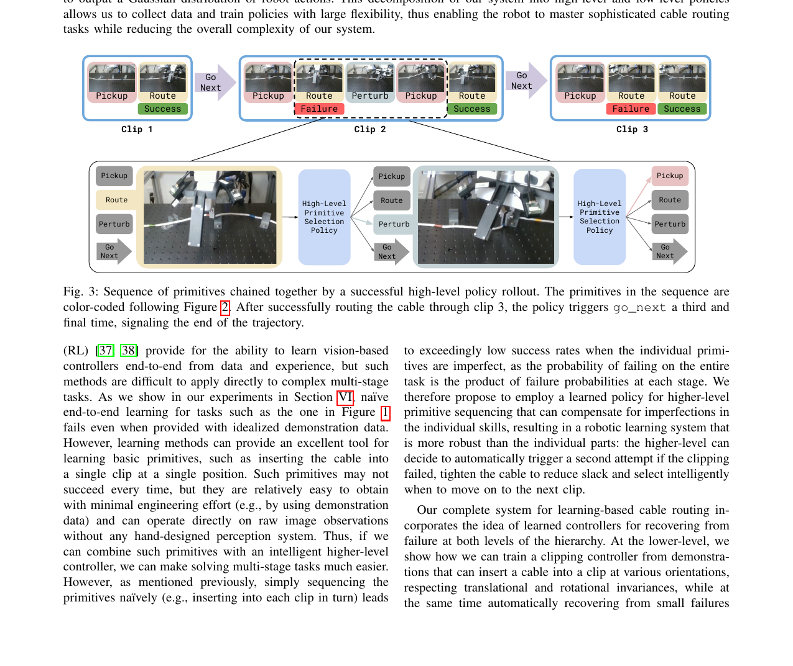
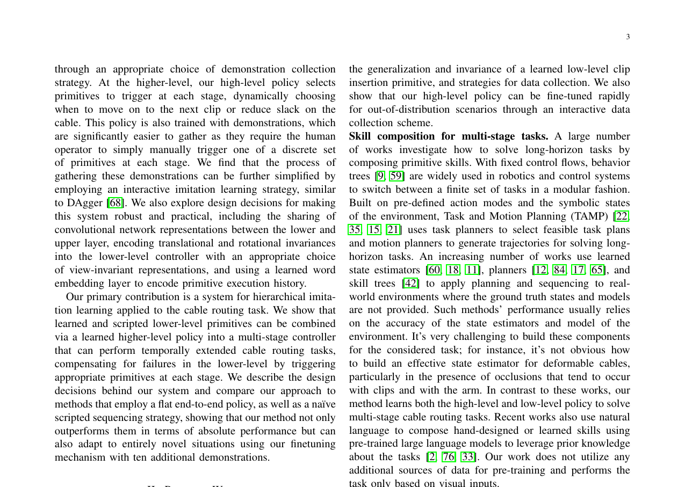
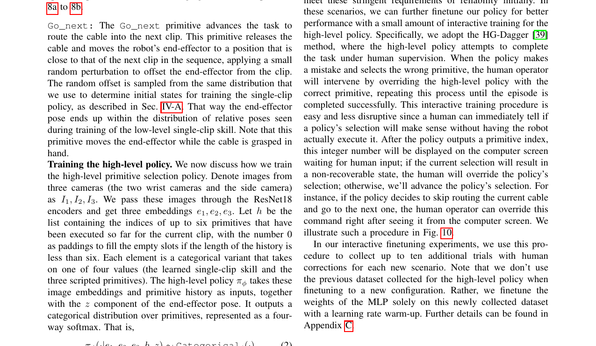

# summary: Multi-Stage Cable Routing through Hierarchical Imitation Learning

> Luo et al., CoRL 2023. arXiv:2307.08927

**케이블 삽입·라우팅처럼 여러 단계로 구성된 작업을 계층적 모방학습으로 학습하며, 각 단계의 실패를 감지하고 자동으로 재시도(corrective action)하는 고수준 정책을 제안한다. 단순 BC 대비 멀티스테이지 성공률을 크게 향상시켰다.**

---

## 1. Introduction

케이블 라우팅은 아래 세 가지 이유로 단순 end-to-end 정책으로는 학습이 어렵다:

- **긴 수평 구조**: 실패 지점이 태스크 어디서든 발생 가능
- **변형 가능 객체**: 케이블 상태를 시각적으로 완전히 관측하기 어려움
- **지각 불확실성**: 단일 카메라 시점의 한계

기존 방법들은 각 단계를 독립적으로 학습하거나 전체를 하나의 정책으로 학습하는데,
두 방식 모두 **실패 후 복구 행동을 명시적으로 다루지 않는다**.

---

## 2. Method

### 핵심 구조 — 계층적 정책 (High-level + Low-level)

| 계층 | 역할 | 입력 |
|------|------|------|
| **High-level policy** | 다음에 실행할 primitive 선택 (sequencing) | 현재 상태 임베딩, 이전 primitive 결과 |
| **Low-level policy** | 선택된 primitive 실제 실행 | RGB 이미지, 로봇 관절 상태 |

### Figure 1 — 전체 시스템 아키텍처



> primitive 시퀀스를 성공적으로 수행한 데모를 기반으로 고수준 정책이 다음 primitive를 결정한다.
> 각 primitive가 실패하면 고수준 정책이 이를 감지하고 재시도하거나 다른 primitive를 선택한다.

---

### Figure 2 — 정책 구조 상세



> 고수준 정책은 분류 헤드로 구현되어 있으며, 현재 태스크 상태와 임베딩을 통해
> 실행할 primitive를 **categorical distribution**으로 샘플링한다.

---

### 학습 방법: 계층적 모방학습

1. 인간 데모로부터 primitive별 저수준 정책 학습 (BC)
2. 저수준 primitive들의 성공/실패 신호를 이용해 고수준 정책 학습
3. **Corrective action**: 실패 시 새 primitive를 선택하거나 동일 primitive를 재시도

---

### 복구 메커니즘

```
실행 흐름:
  고수준 정책 → primitive 선택 → 저수준 실행
                    ↑                  ↓
              [실패 감지 후 재선택] ← [성공/실패 신호]
```

- 실패 감지: 저수준 정책의 종료 조건(임계값 초과 힘, 시간 초과 등)
- 재시도 전략: 고수준 정책이 동일 primitive 재시도 OR 다른 primitive 선택

---

## 3. Experiment

### Figure 3 — 성공률 결과



> 단계별 성공률 및 전체 라우팅 성공률 비교. 계층적 정책이 flat BC 대비 멀티스테이지 작업에서 우수한 복구 성능을 보임.

| 방법 | 멀티스테이지 성공률 | 실패 복구 여부 |
|------|-----------------|--------------|
| Flat BC (end-to-end) | 낮음 | 없음 |
| **Hierarchical IL (제안)** | **높음** | **있음 (자동 재시도)** |
| Oracle (단계별 수동) | 최상 | 수동 |

---

## 4. Conclusion

- 계층적 모방학습으로 멀티스테이지 케이블 조작 학습 가능
- **고수준 정책이 실패를 감지하고 자동으로 복구 primitive를 선택**함으로써 인간 개입 없이 재시도
- 데모 데이터 효율성: 적은 양의 데모로 복잡한 시퀀스 학습 가능

---

## AIC 프로젝트 연관성

| 이 논문 | 우리 프로젝트 적용 가능성 |
|---------|----------------------|
| primitive 기반 계층 구조 | 삽입 시도 → 실패 감지 → 재정렬 → 재시도를 primitive로 분리 |
| 고수준 정책의 실패 감지 | 커넥터 삽입 실패를 시각/힘 신호로 감지하는 모듈 설계 |
| Corrective action 자동화 | 삽입 실패 후 케이블 위치 재조정 정책 학습 |
| 데모 기반 학습 | 실패-복구 데모를 따로 수집하여 고수준 정책 강화 |

> **참고할 핵심 아이디어**: 삽입 실패 시 "케이블 빼기 → 재정렬 → 재삽입"을 각각 별도 primitive로 정의하고, 고수준 정책이 상황에 따라 어떤 primitive를 선택할지 학습하게 하면 단일 정책보다 복구 성공률을 높일 수 있다.
