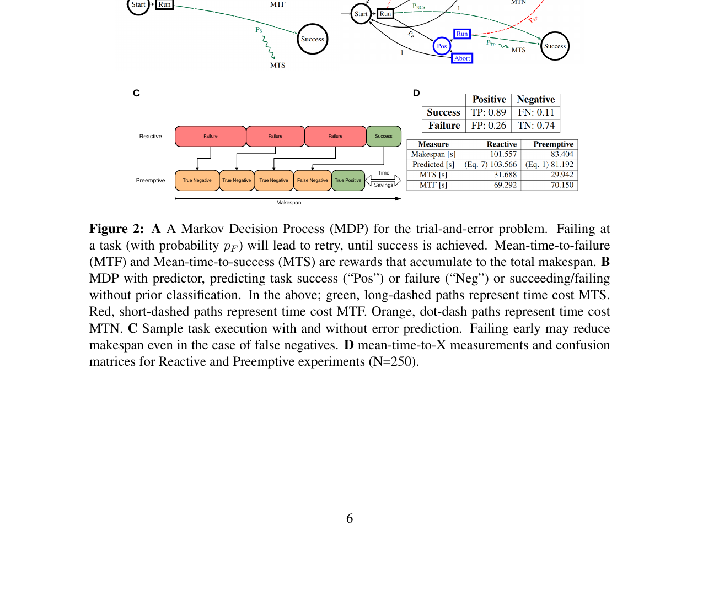
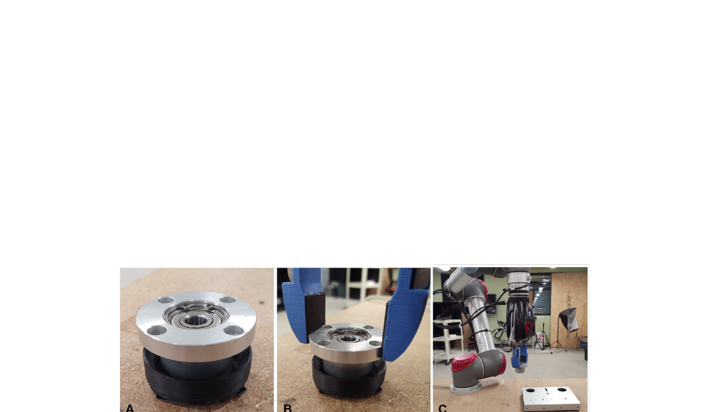
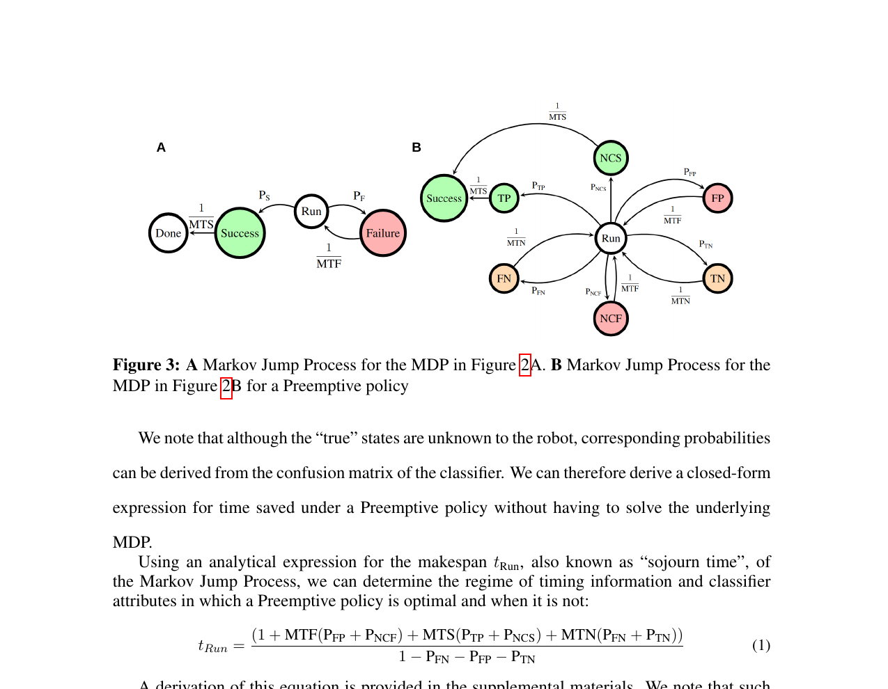

# summary: Optimal Decision Making in Robotic Assembly and Other Trial-and-Error Tasks

> Watson & Correll, arXiv 2023. arXiv:2301.10846

**조립 작업에서 실패를 사전에 예측하여 "지금 포기하고 재시작하는 것이 완료까지 기다리는 것보다 빠른지"를 MDP + Markov Jump Process로 계산하고, dilated CNN으로 힘·토크 데이터에서 실패를 예측한다. Peg-in-hole 실험에서 작업 완료 시간을 101s → 81s로 단축했다.**

---

## 1. Introduction

로봇 조립 작업(케이블 삽입 포함)은 **반복 시도(trial-and-error)** 특성을 가진다:

- 한 번의 시도가 실패하면 초기 상태로 돌아가 재시도
- 문제: **언제 재시작할지** 결정하는 것이 어렵다
  - 너무 일찍 포기 → 성공할 수도 있었던 시도를 버림
  - 너무 늦게 포기 → 이미 실패한 시도를 끝까지 진행

> **핵심 질문**: 실패 예측기(classifier)가 존재할 때, 어떤 조건에서 선제적 재시작(preemptive restart)이 전체 작업 시간을 줄이는가?

---

## 2. Method

### 2-1. MDP 공식화

### Figure 1 — MDP 상태 전이 다이어그램

> A: 기본 MDP — 실패 시 재시도, 성공 시 종료. B: Preemptive 정책의 Markov Jump Process.
> C: 실패 예측기의 Confusion Matrix. D: 측정값 X에 따른 평균 완료 시간 분석.

상태 공간:
- **진행 중 (In-progress)**: 삽입 시도 중
- **성공 (Success)**: 삽입 완료 → 종료
- **실패 (Failure)**: 삽입 실패 → 재시작

실패 예측기 출력:
- **Pos (Positive)**: "이 시도는 실패할 것 같다" → 재시작 고려
- **Neg (Negative)**: "이 시도는 성공할 것 같다" → 계속 진행

---

### 2-2. Makespan 최적화 공식

Markov Jump Process를 이용해 **선제적 재시작 시점** $t_{\text{slow}}$를 closed-form으로 유도:

$$t_{\text{slow}} = \frac{(1 + \text{MTN})(P_{PP} + P_{PN}) + \text{MTS}(P_{NP} + P_{NN}) + \text{MTN}(P_{NP} + P_{NN})}{1 - P_{NP} - P_{NN}}$$

| 기호 | 의미 |
|------|------|
| $\text{MTS}$ | Mean Time to Success (성공까지 평균 시간) |
| $\text{MTN}$ | Mean Time to give up & restart |
| $P_{PP}$ | 실패할 시도를 Positive로 예측한 비율 (True Positive) |
| $P_{NN}$ | 성공할 시도를 Negative로 예측한 비율 (True Negative) |
| $P_{NP}$ | 성공할 시도를 Positive로 예측한 비율 (False Positive) |
| $P_{PN}$ | 실패할 시도를 Negative로 예측한 비율 (False Negative) |

> 이 공식의 핵심: **분류기의 confusion matrix만 알면** 선제적 재시작이 실제로 시간을 줄이는지 수학적으로 판단 가능. FP율이 높을수록 preemptive 정책의 이득이 줄어든다.

---

### 2-3. 실패 예측기: Dilated CNN

### Figure 2 — 실험 하드웨어 셋업

> Peg-in-hole 실험에 사용된 로봇 셋업. F/T 센서로 힘·토크 시계열 데이터를 수집.

- 입력: **힘·토크 시계열** (F/T sensor)
- 모델: **Dilated Convolutional Network** (시계열에서 장기 패턴 포착)
- 출력: 현재 시도가 실패할 확률

Dilated convolution을 사용하는 이유:
- 삽입 실패 신호는 **초반에 미세하게**, **후반에 강하게** 나타남
- 일반 CNN보다 긴 시간 범위의 패턴을 효율적으로 포착

---

## 3. Experiment

### Figure 3 — 성능 비교 결과

> Preemptive 정책 적용 전후 makespan 비교 및 Markov Jump Process 분석.

| 조건 | 평균 완료 시간 (makespan) |
|------|------------------------|
| 선제적 재시작 없음 (baseline) | 101s |
| **선제적 재시작 적용 (제안)** | **81s** |
| 개선율 | **~20% 단축** |

- 실험: Peg-in-hole, $N=120$, $p < 0.05$
- 선제적 재시작은 **confusion matrix 분석으로 실제 이득이 있을 때만 활성화**됨

---

## 4. Conclusion

- 실패 예측 정확도만으로 재시작 여부를 결정하면 안 됨 → **confusion matrix 전체를 고려한 MDP 분석 필요**
- Dilated CNN은 F/T 데이터에서 조기 실패 신호를 효과적으로 포착
- 이 프레임워크는 terminal reward가 명확한 모든 trial-and-error 작업에 일반화 가능

---

## AIC 프로젝트 연관성

| 이 논문 | 우리 프로젝트 적용 가능성 |
|---------|----------------------|
| F/T 기반 실패 조기 감지 | 케이블 삽입 시 힘 이상 → 즉시 재시도 결정 |
| Confusion matrix 기반 재시작 판단 | "지금 포기 vs 계속 진행" 최적 타이밍 계산 |
| Dilated CNN 시계열 분류 | 삽입 과정 중 실시간 실패 예측 모듈로 활용 |
| Makespan 최적화 공식 | 경쟁 환경에서 전체 작업 시간 최소화에 직접 활용 |

> **참고할 핵심 아이디어**: 케이블 삽입 실패를 F/T 센서 시계열로 조기 감지하고, confusion matrix 기반 MDP 공식으로 "지금 재시작"이 "끝까지 진행"보다 유리한지를 실시간으로 계산하면, 삽입 재시도 전략을 최적화할 수 있다.
