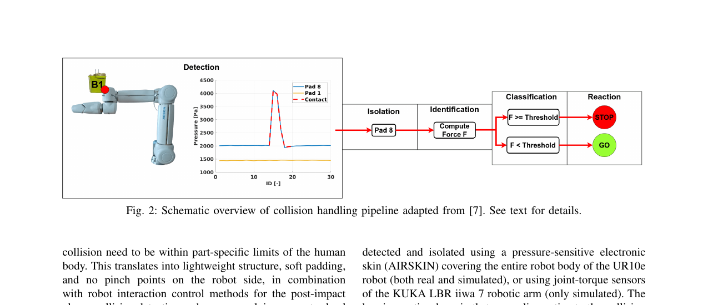

# summary: F/T 센서 기반 매니퓰레이터 충돌 감지 선행 연구 조사

> Rustler et al., arXiv 2024 (2409.20184), Kim et al., arXiv 2015 (1501.05007), Mohammad et al., ICRA 2023 (2308.09633)

**F/T 센서 및 관성/운동량 관측기를 활용하여 매니퓰레이터의 충돌을 실시간으로 감지하고 대응하는 기술을 조사함. 고정된 임계값 대신 로봇의 유효 질량과 속도를 고려한 적응형 임계값 설정으로 생산성을 45% 향상시킨 사례와 일반화된 운동량 관측기(GMO)를 통한 정밀한 외력 추정 기법이 핵심임.**

---

## 1. Introduction
로봇이 사람과 협업하거나 복잡한 환경(예: 케이블 삽입)에서 작업할 때, 의도치 않은 충돌을 감지하고 안전하게 반응하는 것은 필수적임. 전통적인 PFL(Power and Force Limiting) 방식은 너무 보수적인 임계값을 사용하여 잦은 정지로 인한 생산성 저하가 문제됨. 최근 연구들은 **로봇 역학 모델과 센서 융합**을 통해 실제 충돌과 정상적인 접촉력을 구분하는 데 집중하고 있음.

---

## 2. Method (Adaptive Collision Sensitivity)

### Figure 2 — Collision Handling Pipeline

> 충돌 감지(Detection), 분리(Isolation), 식별(Identification), 분류(Classification), 반응(Reaction)으로 이어지는 5단계 표준 파이프라인. 각 단계에서 F/T 센서와 로봇 피부(Electronic Skin) 데이터를 활용함.

---

### 핵심 수식: 적응형 충돌 임계값

$$F_{estimated} = f(m_{eff}(\mathbf{q}), \mathbf{v})$$

> 로봇의 현재 관절 각도($\mathbf{q}$)에 따른 **유효 질량($m_{eff}$)**과 현재 **속도($\mathbf{v}$)**를 바탕으로 충돌 시 예상되는 충격력을 실시간 계산함. 이를 통해 안전 규정을 준수하면서도 불필요한 정지를 최소화함.

---

## 3. 주요 연구 비교

| 연구 (연도) | 주요 센서 | 핵심 알고리즘 | 특징 및 성과 |
|---------|------|------|------|
| Rustler (2024) | F/T, E-Skin | Adaptive Thresholding | **생산성 45% 향상**, 충돌 위치별 개별 대응 |
| Kim (2015) | Joint Torque | Floating Base Dynamics | 모바일 플랫폼 전신 충돌 감지, Admittance 제어 |
| Mohammad (2023) | Motor Current | Momentum Observer | 패러럴 로봇 대상, 칼만 필터 및 슬라이딩 모드 비교 |

---

## 4. Conclusion
F/T 센서 기반 충돌 감지는 단순 임계값 비교에서 벗어나 **로봇의 동역학적 특성을 반영한 관측기(Observer)** 기반 방식으로 진화하고 있음. 특히 케이블 삽입과 같이 '의도된 접촉'이 빈번한 작업에서는 삽입 힘과 외부 충돌을 구분하기 위한 적응형 알고리즘이 필수적임.

---

## AIC 프로젝트 연관성

| 이 논문 | 우리 프로젝트 적용 가능성 |
|---------|----------------------|
| 적응형 임계값 설정 | 케이블 삽입 시 발생하는 정상 저항력과 포트 외부 충돌을 구분하는 로직에 적용 가능 |
| Momentum Observer | 가속도 및 마찰력을 제외한 순수 외력을 추정하여 삽입 성공 여부를 더 정밀하게 판단 |

> **참고할 핵심 아이디어**: 현재 `StagedPolicy.py`의 고정 임계값(15N/18N)을 로봇의 **이동 속도와 방향에 따른 가변 임계값**으로 업데이트하여, 고속 접근 시의 오탐지(False Positive)를 줄이고 정밀 삽입 시의 민감도를 높일 수 있음.
