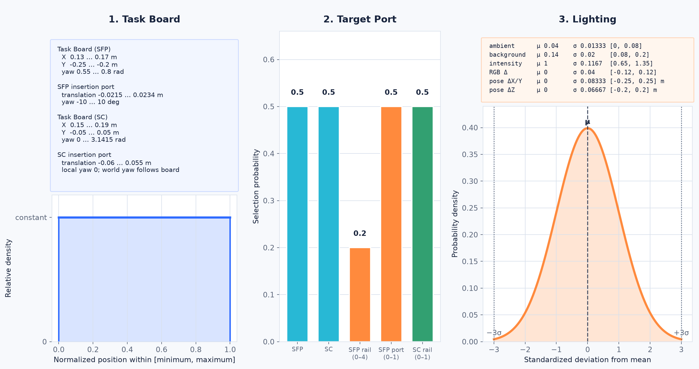

# AIC Sejong

[한국어](readme/README.ko.md) | [English](readme/README.en.md)

Intrinsic 및 Open Robotics가 주관한 AI for Industry Challenge의 솔루션 코드입니다 <br>


## 대회 설명
AI for Industry Challenge는 Universal Robots(UR5e) 로봇 팔이 케이블을 지정된 포트에 삽입하는 Peg-In-Hole Task입니다.

<details>
<summary><strong>Task Board Overview</strong></summary>

<table>
  <tr>
    <th colspan="2">SFP</th>
  </tr>
  <tr>
    <td width="50%"></td>
    <td width="50%"></td>
  </tr>
  <tr>
    <th colspan="2">SC</th>
  </tr>
  <tr>
    <td width="50%"></td>
    <td width="50%"></td>
  </tr>
</table>

</details>

<details>
<summary><strong>Task Board Randomization</strong></summary>

매 Trial마다 Task Board의 XY/yaw, 카드의 위치, 삽입 포트 종류가 달라집니다

| 파라미터 | Trial 1/2 (NIC/SFP) | Trial 3 (SC) |
|----------|---------------------|--------------|
| `task_board_x` | [0.13, 0.17] m | [0.15, 0.19] m |
| `task_board_y` | [-0.25, -0.15] m | [-0.05, 0.05] m |
| `task_board_yaw` | [0.0, 3.1415] rad | [0.0, 3.1415] rad |

<br>

| 랜덤화 요소 | 정확한 범위 및 구성 |
|-------------|----------------------|
| SFP Port | `location`: rail 0~4 중 활성화<br>`translation`: [-0.0215, 0.0234] m<br>`yaw`: [-0.1745, 0.1745] rad ([-10°, +10°]) |
| SC Port | `location`: rail 0~1 중 활성화<br>`translation`: [-0.06, 0.055] m<br>`yaw`: 0.0 |
| Cable/gripper perturbation | `cable_type`: `sfp_sc_cable`, `sfp_sc_cable_reversed`<br>`gripper_offset_noise`: [-0.002, 0.002] m

</details>

<details>
<summary><strong>케이블 삽입 태스크 및 정책 구성</strong></summary>

참가자는 카메라 관측, 로봇 상태, 힘/토크(Force/Torque) 센서 정보를 활용하여 포트 위치와 자세를 추정하고, 케이블 삽입을 수행하는 정책을 개발해야 합니다.

본 솔루션은 YOLO 기반 포트 검출, 멀티뷰 위치 추정, pose/yaw 보정, 힘 센서 기반 재시도 로직을 하나의 최종 정책으로 통합했습니다.

</details>

## Key Contributions

```
1. Gazebo Simulator 기반 랜덤화 환경 데이터 수집용 ROS2 노드 개발
2. YOLO Keypoint Detection 및 Multiview Triangulation 기반 포트 3-DoF 추론 로직 구현, 5개 Case에서 MAE ~5mm 내외로 예측 정확도 달성
3. 케이블 정렬을 위한 MultiView Bilinear Cross-Attention Regressor 구현, Fine-Grained한 Case에서 Worst Case 대비 XYZ MAE 21.3% 및 RPY MAE 16.5% 향상
```

## 시작하기

### Requirements

| 항목 | 요구 사항 |
|------|-----------|
| OS | Ubuntu 24.04 |
| ROS 2 | Kilted Kaiju |
| Package manager | Pixi |
| Container | Docker, Distrobox |
| Simulator | Gazebo |
| Middleware | `rmw_zenoh_cpp` |
| Hardware | NVIDIA RTX 2070+ / 8 GB VRAM, RAM 32 GB+ |

정책 노드는 호스트의 Pixi 환경, Gazebo/RViz 및 scoring engine은 eval 컨테이너에서 실행

### 1. Pixi 환경 설정
```bash
git clone https://github.com/JungSeong/AIC_Sejong.git ~/AIC_Sejong
cd ~/AIC_Sejong/ws_aic/src
pixi install
```

### 2. Distrobox 설정
```bash
export DBX_CONTAINER_MANAGER=docker

docker pull ghcr.io/intrinsic-dev/aic/aic_eval:latest
distrobox create -r --nvidia -i ghcr.io/intrinsic-dev/aic/aic_eval:latest aic_eval
```

### 3. 데이터 수집 노드 실행

데이터 수집은 `aic_model`에 데이터 수집용 policy를 지정해서 실행합니다. Gazebo와 scoring engine은 eval 컨테이너에서 실행하고, policy 노드는 호스트 Pixi 환경에서 실행합니다.

#### 3-1. 시뮬레이터 실행

데이터 수집에서는 GT TF와 task board 랜덤화 파라미터가 필요하므로 `ground_truth:=true`로 실행합니다.

```bash
export DBX_CONTAINER_MANAGER=docker

distrobox enter -r aic_eval -- /entrypoint.sh \
  ground_truth:=true \
  start_aic_engine:=true
```

#### 3-2. 기본 LeRobot 데이터셋 수집

`data_gen_node.LeRobot`은 로봇 상태, action, 카메라 영상, plug-to-port 상태, stiffness/damping, phase, insertion 결과를 LeRobot 포맷으로 저장합니다.

```bash
export AIC_LEROBOT_OUT_DIR=~/AIC_Sejong/data/lerobot
export AIC_LEROBOT_REPO_ID=aic-sejong-team/aic-dataset
export AIC_LEROBOT_VERSION=v1.0

cd ~/AIC_Sejong/ws_aic/src
pixi run ros2 run aic_model aic_model \
  --ros-args -p use_sim_time:=true \
  -p policy:=data_gen_node.LeRobot
```

#### 3-3. Vision-Offset 정렬 데이터셋 수집

`data_gen_node.PortOffsetCollect`은 ROS 2 Ground Truth TF로 approach/collect 목표를 만들고, center image 기준 timestamp gating을 통과한 경우에만 entrance frame 기준 실제 plug-port offset/RPY와 camera image를 저장합니다. YOLO, multi-view triangulation, settle 대기, TCP 속도 기반 정지 판정은 이 수집 경로에서 사용하지 않습니다. 기본 출력 경로는 `AIC_VISION_OFFSET_DATASET_DIR`이며, 지정하지 않으면 노드 내부 기본 경로를 사용합니다.

```bash
export AIC_VISION_OFFSET_DATASET_DIR=~/AIC_Sejong/data/vision_offset_dataset
export AIC_VISION_OFFSET_RECORD=1
export AIC_VISION_OFFSET_PUSH_TO_HUB=false
export AIC_VISION_OFFSET_REPO_ID=aic-sejong-team/aic-vision-offset-dataset
export AIC_VISION_OFFSET_HF_REVISION=main
export AIC_VISION_OFFSET_UPLOAD_ON_PORT_TYPE=sc

cd ~/AIC_Sejong/ws_aic/src
pixi run ros2 run aic_model aic_model \
  --ros-args -p use_sim_time:=true \
  -p policy:=data_gen_node.PortOffsetCollect
```

이때 Hugging Face 업로드를 사용할 경우 Pixi 환경에서 먼저 로그인해야 합니다.

```bash
cd ~/AIC_Sejong/ws_aic/src
pixi run hf auth login
pixi run hf auth whoami
```

`401 Repository Not Found`가 발생하면 repo가 없거나 현재 token이 해당 dataset repo에 대한 write 권한을 갖고 있지 않은 상태입니다. 이 경우 `AIC_VISION_OFFSET_REPO_ID`를 본인 계정/조직의 dataset repo로 바꾸거나, 권한이 있는 token으로 다시 로그인합니다.

| Policy | 용도 | 저장 위치 | Output format |
|--------|------|-----------|---------------|
| `data_gen_node.LeRobot` | 기본 에피소드 수집 | `$AIC_LEROBOT_OUT_DIR/$AIC_LEROBOT_VERSION`, `/tmp/aic_episodes/<episode>/episode_summary.json` | LeRobot dataset (`meta/*.json`, `data/*.parquet`, `videos/*/*.mp4`) |
| `data_gen_node.PortOffsetCollect` | GT-guided vision-offset 정렬 학습 샘플 수집 | `$AIC_VISION_OFFSET_DATASET_DIR` | multi-camera image + 실제 offset/RPY metadata JSON/JSONL |

#### 3-4. 자동 수집 스크립트

여러 세트를 반복 수집하고 Gazebo 실행까지 자동화하려면 `ais_auto_capture` 스크립트를 사용합니다. LeRobot 에피소드 수집과 PortOffsetCollect 정렬 데이터 수집은 서로 다른 스크립트를 사용합니다.

```bash
cd ~/AIC_Sejong/ws_aic/src

# LeRobot episode 자동 수집
pixi run python ais/ais_auto_capture/collect_lerobot_data.py \
  --sets 10 \
  --data-policy LeRobot \
  --lerobot-out-dir ~/AIC_Sejong/data/lerobot \
  --lerobot-repo-id aic-sejong-team/aic-dataset \
  --lerobot-version v1.0 \
  --no-push-to-hub

# PortOffsetCollect 기반 vision-offset 정렬 데이터 자동 수집
pixi run python ais/ais_auto_capture/collect_portoffset_randomization_data.py \
  --trials 20 \
  --samples-per-trial 24 \
  --port-types sfp,sc \
  --port-order random \
  --dataset-version v1.0 \
  --push-to-hub false \
  --record-rosbag true \
  --headless \
  --cleanup
```

aarch64 소스 빌드 환경에서 LeRobot episode를 수집할 때는 동일한 인자로 `collect_lerobot_data_aarch.py`를 사용합니다. YOLO 접근 데이터셋은 `collect_yolo_data_aarch.py`를 사용합니다.

#### PortOffsetCollect 자동 수집 파라미터

`collect_portoffset_randomization_data.py`는 Gazebo를 trial마다 일반 사용자 권한의 Distrobox로 자동 실행하고, SFP/SC target과 simulator 조명을 함께 랜덤화합니다. 별도 옵션 없이 항상 `distrobox enter aic_eval` 형태로 진입하며 `-r`은 사용하지 않습니다. 각 trial 시작 시 `Task Board`, `Port`, `Cable / Robot`, `Simulator / Lighting` 카테고리별 랜덤화 값이 색상/볼드 로그로 출력됩니다.

`--push-to-hub`, `--color-log`, `--randomize-lighting`, `--launch-rviz`, `--record-rosbag`은 각각 하나의 옵션에 `true` 또는 `false`를 전달합니다. CLI 기본값과 choices는 `portoffset_randomization/constants.py`에서 관리합니다.

Gazebo GUI는 유지하고 RViz만 끄려면 `--launch-rviz false`를 사용합니다. `--headless`는 Gazebo GUI와 RViz를 모두 끕니다.

`--cleanup`은 이전 수집이 비정상 종료되어 남은 collector 소유 프로세스를 정리한 뒤 새 수집을 계속합니다. `--cleanup-only`는 같은 정리만 수행하고 trial을 시작하지 않습니다. 두 옵션 모두 데이터셋이나 생성된 결과 파일을 삭제하지 않습니다.

```bash
# 잔존 프로세스 정리 후 수집
pixi run python ais/ais_auto_capture/collect_portoffset_randomization_data.py \
  --cleanup \
  --trials 20

# 잔존 프로세스 정리 후 즉시 종료
pixi run python ais/ais_auto_capture/collect_portoffset_randomization_data.py \
  --cleanup-only
```

#### 시나리오 랜덤화 분포

각 연속 변수는 독립적으로 샘플링합니다. Gaussian 조명의 제한 범위는 `μ ± 3σ`이며, 범위 밖 표본은 다시 추출합니다.

| 시나리오 요소 | 랜덤화 변수 | 분포 | 기본 파라미터 / 범위 |
|---|---|---|---|
| Task Board (SFP) | world X / Y / yaw | Continuous Uniform | X `U(0.13, 0.17) m`, Y `U(-0.25, -0.20) m`, yaw `U(3.10, 3.1415) rad` |
| Task Board (SC) | world X / Y / yaw | Continuous Uniform | X `U(0.15, 0.19) m`, Y `U(-0.05, 0.05) m`, yaw `U(3.10, 3.1415) rad` |
| 삽입 포트 타입 | SFP / SC | Discrete Uniform | 기본 `--port-order random`: 각각 `P=0.5`; `round_robin` 선택 가능 |
| SFP 삽입 포트 | NIC rail / SFP port index | Discrete Uniform | rail `{0,1,2,3,4}`, port `{0,1}`에서 동일 확률 선택 |
| SFP 삽입 포트 | NIC translation / yaw | Continuous Uniform | translation `U(-0.0215, 0.0234) m`, yaw `U(-10, 10) deg` |
| SC 삽입 포트 | SC rail / translation | Discrete + Continuous Uniform | rail `{0,1}` 동일 확률, translation `U(-0.06, 0.055) m`; local yaw는 `0`, world yaw는 Task Board yaw를 따름 |
| 조명 ambient | scene ambient 밝기 | Truncated Gaussian | `N(μ=0.04, σ=0.0133)`, `[0, 0.08]` |
| 조명 background | scene background 밝기 | Truncated Gaussian | `N(μ=0.14, σ=0.02)`, `[0.08, 0.20]` |
| 조명 intensity | light intensity scale | Truncated Gaussian | `N(μ=1.0, σ=0.1167)`, `[0.65, 1.35]` |
| 조명 RGB | diffuse 채널별 ΔR / ΔG / ΔB | Truncated Gaussian | 각 채널 `N(μ=0, σ=0.04)`, `[-0.12, 0.12]`; 최종 RGB는 `[0,1]`로 제한 |
| 조명 위치 | pose ΔX / ΔY / ΔZ | Truncated Gaussian | ΔX·ΔY `N(0, 0.0833) m`, `[-0.25, 0.25] m`; ΔZ `N(0, 0.0667) m`, `[-0.20, 0.20] m` |



그래프는 시나리오의 `LIMITS`, 포트 개수 상수, 수집 CLI의 조명 기본값을 직접 읽어 생성합니다. 파라미터 변경 후 다음 명령을 다시 실행하면 PNG가 갱신됩니다.

```bash
cd ~/AIC_Sejong/ws_aic/src
pixi run python ais/ais_auto_capture/plot_scenario_randomization.py
```

실행 시 `--light-intensity-scale-min`, `--light-intensity-scale-max`, `--light-color-jitter`, `--light-pose-xy-jitter-m`, `--light-pose-z-jitter-m`, `--ambient-min/max`, `--background-min/max`, `--port-types`, `--port-order`로 그래프 파라미터를 직접 덮어쓸 수 있습니다. 전체 옵션은 `--help`로 확인합니다.

| 파라미터 종류 | 범위 | 역할 |
|---|---|---|
| Target port type | `--port-types sfp`, `sc`, `sfp,sc` 기본 `sfp,sc` | 수집할 포트 계열을 선택합니다. 기본은 SFP와 SC를 모두 수집합니다. |
| Target port order | `--port-order random` 또는 `round_robin`, 기본 `random` | SFP/SC trial 배치 순서를 결정합니다. |
| Trial count | `--trials`, 기본 `20` | 생성 및 수집할 Gazebo trial 개수입니다. |
| Samples per trial | `--samples-per-trial`, 기본 `24` | 한 trial의 수집 시도 수입니다. timestamp/visibility gating에서 거부되면 실제 저장 수는 더 적을 수 있습니다. |
| SFP task board X | `0.13 ~ 0.17 m` | SFP/NIC trial에서 task board의 world X 위치를 랜덤화합니다. |
| SFP task board Y | `-0.25 ~ -0.20 m` | SFP/NIC trial에서 task board의 world Y 위치를 랜덤화합니다. |
| SFP task board yaw | `3.10 ~ 3.1415 rad` | SFP/NIC trial에서 task board 회전각을 랜덤화합니다. |
| SC task board X | `0.15 ~ 0.19 m` | SC trial에서 task board의 world X 위치를 랜덤화합니다. |
| SC task board Y | `-0.05 ~ 0.05 m` | SC trial에서 task board의 world Y 위치를 랜덤화합니다. |
| SC task board yaw | `3.10 ~ 3.1415 rad` | SC trial에서 task board 회전각을 랜덤화합니다. |
| Task board Z / roll / pitch | `z=1.14 m`, `roll=0`, `pitch=0` | 보드 높이와 기울기는 고정해 xy/yaw 중심의 scene variation만 적용합니다. |
| SFP NIC rail | `0 ~ 4` 중 1개 | SFP target이 들어갈 NIC rail을 선택합니다. |
| SFP port index | `sfp_port_0` 또는 `sfp_port_1` | SFP target port를 선택합니다. |
| SFP NIC translation | `-0.0215 ~ 0.0234 m` | 선택된 NIC card mount의 rail 방향 위치를 랜덤화합니다. |
| SFP NIC yaw | `-10 ~ +10 deg` | 선택된 NIC card mount의 yaw를 랜덤화합니다. |
| SC rail | `0 ~ 1` 중 1개 | SC target이 들어갈 SC rail을 선택합니다. |
| SC translation | `-0.06 ~ 0.055 m` | 선택된 SC mount의 rail 방향 위치를 랜덤화합니다. |
| Gripper offset noise | 각 축 `-0.002 ~ +0.002 m` | cable gripper offset 기준값에 미세 오차를 더합니다. SFP 기준값은 `[0, 0.015385, 0.04245] m`, SC 기준값은 `[0, 0.015385, 0.04045] m`입니다. |
| Cable RPY noise | `--cable-rpy-noise-deg`, 기본 `±20 deg` | cable 초기 roll/pitch/yaw 기준값에 회전 오차를 더합니다. |
| Robot home joint noise | `--robot-joint-noise-deg`, 기본 `±4 deg` | robot home joint 초기값에 관절별 오차를 더합니다. |
| Collect XYZ range | X/Y 기본 `-50 ~ +50 mm`, Z 기본 `0 ~ 100 mm` | PortOffsetCollect가 포트 기준 위치 offset sample을 생성하는 범위입니다. `--dx-*`, `--dy-*`, `--dz-*`로 축별 override할 수 있습니다. |
| Collect RPY range | roll/pitch 기본 `±25 deg`, yaw 기본 `±35 deg` | PortOffsetCollect가 포트 기준 자세 offset sample을 생성하는 범위입니다. `--roll-*`, `--pitch-*`, `--yaw-*`로 축별 override할 수 있습니다. |
| RPY norm cap | `--rpy-norm-max-rad`, 기본 미사용 | sampling된 RPY vector magnitude를 제한합니다. |
| Actual RPY norm filter | `--actual-rpy-norm-max-rad`, 기본 `--rpy-norm-max-rad` 정책값 사용 | 저장 직전 실제 plug-port quaternion angle이 큰 sample을 제외합니다. |
| Timestamp sync tolerance | `--sync-tolerance-ms`, 기본 `30 ms` | 좌·중·우 Image, ControllerState, 동적 TF의 ROS source timestamp skew가 이 값을 넘으면 sample을 저장하지 않습니다. |
| Summary grace / trial interval | summary 후 `3 s`, trial 간 `3 s` | AIC engine의 scoring/reset 완료를 기다린 뒤 종료하고, 종료 검증 후 다음 trial을 시작합니다. |
| Simulator teardown | 정상 종료: SIGINT `5 s` → SIGTERM `2 s` → SIGKILL `1 s`; Ctrl+C: SIGTERM `2 s` → SIGKILL `1 s` | 외부 Distrobox wrapper PGID와 config marker로 찾은 내부 ROS 2/Gazebo PGID를 각각 등록합니다. Ctrl+C 시 추가 SIGINT는 cleanup이 끝날 때까지 무시하며, 내부 simulator와 wrapper 종료 및 registry 갱신을 완료합니다. |
| Pre-run cleanup | `--cleanup`, 기본 off | run marker와 registry로 소유권이 확인된 이전 policy/Gazebo PGID를 정리한 후 새 수집을 시작합니다. |
| Cleanup only | `--cleanup-only`, 기본 off | 이전 수집의 잔존 PGID만 정리하고 trial을 시작하지 않은 채 종료합니다. |
| Visibility filter | `--min-visible-cameras` 기본 `1`, `--visibility-margin-px` 기본 `8 px` | 포트가 충분히 보이는 sample만 저장하도록 카메라 visibility 기준을 정합니다. |
| Lighting randomization | 기본 `true`, `--randomize-lighting false`로 비활성화 | trial마다 Gazebo world SDF를 생성해 조명/배경을 truncated Gaussian 분포로 랜덤화합니다. |
| Light intensity scale | `N(μ=1.0, σ=0.1167)`, `[0.65, 1.35]` | `enclosure_light`, `ceiling_01`, `ceiling_02` intensity에 곱할 scale입니다. |
| Light color jitter | `N(μ=0, σ=0.04)`, `[-0.12, 0.12]` | 각 light diffuse RGB를 channel별로 변화시킵니다. |
| Light pose jitter | XY `N(0, 0.0833) m`, `[-0.25, 0.25] m`; Z `N(0, 0.0667) m`, `[-0.20, 0.20] m` | 각 light 위치를 변화시켜 highlight/shadow 위치를 바꿉니다. |
| Ambient / background | ambient `N(0.04, 0.0133)`, `[0, 0.08]`; background `N(0.14, 0.02)`, `[0.08, 0.20]` | scene ambient와 background 밝기를 변화시킵니다. |
| Gazebo mode | `--headless` on/off | 활성화하면 Gazebo GUI와 RViz를 모두 비활성화합니다. |
| RViz | `--launch-rviz true\|false`, 기본 `true` | `false`이면 Gazebo GUI 상태와 관계없이 RViz만 비활성화합니다. `--headless` 사용 시에는 항상 비활성화됩니다. |
| Color log | 기본 `true`, `--color-log false` 또는 `NO_COLOR`로 비활성화 | trial별 랜덤화 로그를 색상/볼드로 구분해 출력합니다. |
| Trial timeout | 기본 `time-limit-s + 180 s` | `episode_summary.json` 생성 대기 제한 시간입니다. |
| Dataset version | `--dataset-version`, 기본 빈 문자열 | `data/ais_portoffset_randomization/{version}` 하위에 저장할 버전을 지정합니다. |
| Hugging Face upload | 기본 `false`, `--push-to-hub true`로 활성화 | PortOffsetCollect policy에 `AIC_VISION_OFFSET_PUSH_TO_HUB`를 명시 전달합니다. 실험 중 의도치 않은 업로드를 막기 위해 runner 기본값은 `false`입니다. |
| Hugging Face target | `--vision-offset-repo-id`, `--vision-offset-hf-revision`, `--vision-offset-hf-path-in-repo`, `--hf-private` | 업로드할 HF dataset repo, revision, repo 내부 경로, private repo 생성 여부를 지정합니다. |
| Upload port filter | `--upload-on-port-type` 값 `sfp`, `sc`, 또는 빈 문자열 기본 빈 문자열 | 특정 포트 타입 trial에서만 업로드하도록 제한합니다. 빈 문자열이면 PortOffsetCollect가 포트 타입 제한 없이 판단합니다. |

#### 3-5. Timestamp-gated 수집과 Foxglove 디버깅

##### 현재 저장 판정 로직

sample 기준 시각은 center image의 `header.stamp`입니다. 기본 허용 오차는 `--sync-tolerance-ms 30`이며 내부에서는 nanosecond로 비교합니다.

```text
capture_stamp = center_image.header.stamp
camera_skew = max(left, center, right) - min(left, center, right)
controller_skew = abs(controller - capture_stamp)
tf_skew = max(abs(port_lookup_result.stamp - capture_stamp),
              abs(plug_lookup_result.stamp - capture_stamp))

저장 조건:
  camera_skew <= tolerance
  controller_skew <= tolerance
  tf_skew <= tolerance
```

다음 경우에는 이미지, sidecar JSON, `metadata.jsonl`을 쓰지 않고 sample count도 증가시키지 않습니다.

- observation, Image, ControllerState timestamp가 없거나 `0`인 경우
- 세 Image의 최대-최소 timestamp 범위가 허용 오차를 넘는 경우
- ControllerState와 center image의 timestamp 차이가 허용 오차를 넘는 경우
- center image 시각의 port/plug TF를 조회할 수 없는 경우
- 동적 port/plug TF timestamp 차이가 허용 오차를 넘는 경우

`/tf_static`의 `stamp=0`은 시간 불변 transform으로 처리해 허용합니다. 로봇 settle 대기와 TCP 선속도·각속도 기반 정지 판정은 삭제되었으며, motion 명령 후 observation을 한 번 읽어 timestamp 조건만 검사합니다.

##### 저장되는 timestamp metadata

저장된 각 camera sidecar와 최상위 `metadata.jsonl`에는 동일한 `timestamps`가 들어갑니다.

```json
{
  "timestamps": {
    "clock": "ros",
    "unit": "nanoseconds",
    "capture_stamp_ns": 1234567890,
    "images": {
      "left": 1234550000,
      "center": 1234567890,
      "right": 1234570000
    },
    "controller_stamp_ns": 1234560000,
    "tf": {
      "port": {"stamp_ns": 1234567890, "is_static": false, "skew_ns": 0},
      "plug": {"stamp_ns": 1234567890, "is_static": false, "skew_ns": 0}
    },
    "skew_ns": {
      "camera": 20000,
      "controller": 7890,
      "tf": 0
    },
    "sync_tolerance_ns": 30000000,
    "sync_valid": true,
    "dataset_write_stamp_ns": 1234600000
  }
}
```

`capture_stamp_ns`는 sensor 기준 시각이고 `dataset_write_stamp_ns`는 파일 쓰기를 시작한 ROS 시각입니다. 둘의 차이는 디스크 기록 지연이며 source 동기화 skew에 포함하지 않습니다.

##### trial별 MCAP 자동 녹화

최초 한 번 Pixi 의존성을 설치한 뒤 자동 recorder를 사용합니다.

```bash
cd /home/swlinux/Desktop/workspace/AIC_Sejong/ws_aic/src
pixi install

pixi run python ais/ais_auto_capture/collect_portoffset_randomization_data.py \
  --trials 1 \
  --samples-per-trial 4 \
  --port-types sfp,sc \
  --dataset-version 0726-001 \
  --sync-tolerance-ms 30 \
  --record-rosbag true \
  --headless \
  --cleanup
```

trial lifecycle은 다음 순서를 유지합니다.

```text
Gazebo + Zenoh 시작
  → rosbag 시작 및 MCAP 생성 확인
  → PortOffset policy 시작
  → policy 종료
  → rosbag SIGINT 및 MCAP finalize 검증
  → Gazebo SIGINT → SIGTERM → 필요 시 SIGKILL
  → 다음 trial
```

MCAP은 다음 위치에 생성됩니다.

```text
rosbags/portoffset/<dataset-version>/<run-id>/trial_<index>_<task-id>/
├── metadata.yaml
└── *.mcap
```

`[rosbag] RECORDING STARTED`와 `[rosbag] RECORDING COMPLETED`가 green bold로 출력돼야 합니다. 완료 판정은 `metadata.yaml`, 0보다 큰 message count, 모든 MCAP의 header/footer magic 검사를 모두 통과해야 합니다.

##### Foxglove에서 특정 dataset sample 검증

Foxglove는 gating을 대신 수행하는 저장기가 아니라, sidecar에 기록된 판정이 실제 MCAP source message와 일치하는지 대조하는 디버깅 도구입니다.

1. 검증할 camera sidecar JSON에서 `sample_id`, `image`, `timestamps.capture_stamp_ns`, `timestamps.skew_ns`를 확인합니다.
2. 같은 trial 디렉터리의 `*.mcap`을 Foxglove의 `Open local file(s)`로 다시 선택해 엽니다.
3. 세 Image 패널, Raw Messages, 3D 패널을 추가합니다.
4. 재생 커서를 `capture_stamp_ns / 1e9` 초로 이동하고 source stamp와 화면을 비교합니다.
5. sidecar가 가리키는 JPEG와 해당 시각의 Foxglove camera frame이 같은 장면인지 확인합니다.

| 패널 | Topic | 확인 내용 |
|---|---|---|
| Image × 3 | `/left_camera/image`, `/center_camera/image`, `/right_camera/image` | 같은 capture 구간의 세 camera frame과 `header.stamp`를 확인합니다. |
| Raw Messages | 세 camera, `/aic_controller/controller_state` | sidecar의 image/controller stamp와 실제 `header.stamp`가 일치하는지 확인합니다. |
| Raw Messages | `/tf`, `/tf_static` | capture 시각 전후에 port/plug transform이 연속해서 존재하는지와 static 여부를 확인합니다. |
| 3D | `/tf`, `/tf_static` | Fixed frame을 `base_link`로 두고 port entrance, cable tip, `gripper/tcp`의 해당 시각 pose를 확인합니다. |
| Plot (선택) | `/aic_controller/controller_state.tcp_velocity.*.@norm` | motion 상태를 참고합니다. 속도는 저장 승인 조건이 아닙니다. |

Foxglove에서는 `Log time`이 아니라 message의 `Header stamp`를 기준으로 비교합니다.

```text
sidecar capture_stamp_ns == center Image.header.stamp
sidecar images.*         == 각 Image.header.stamp
sidecar controller       == ControllerState.header.stamp
sidecar skew_ns          == 위 source stamp로 다시 계산한 값
sidecar sync_valid       == true
```

TF2 lookup 결과는 여러 raw TF를 합성하거나 보간할 수 있으므로 `timestamps.tf.*.stamp_ns`가 `/tf`의 단일 raw message stamp와 반드시 같지는 않습니다. Foxglove에서는 capture 시각에 3D transform이 끊기지 않고 표시되는지, 해당 시각 전후 raw TF가 존재하는지를 확인합니다.

허용 오차가 있기 때문에 모든 source가 완전히 같은 nanosecond임을 보장하지는 않습니다. 저장된 sample은 각 skew가 설정값 이하임을 보장합니다. `--sync-tolerance-ms 0`은 완전 일치만 허용하지만 비동기 source에서는 대부분 거부될 수 있습니다.

##### Foxglove/MCAP 문제 해결

| 증상 | 확인 및 해결 |
|---|---|
| `Failed to initialize source` / file permission | 녹화 중인 파일이 아닌지 확인하고 `[rosbag] RECORDING COMPLETED` 이후 다시 엽니다. `namei -l <file>`과 `ls -l <file>`로 상위 디렉터리 실행 권한과 파일 읽기 권한을 확인한 뒤, 최근 파일 참조가 아니라 `Open local file(s)`로 재선택합니다. |
| MCAP이 열리지만 topic이 없음 | `pixi run ros2 bag info <trial-dir>`로 message count를 확인합니다. 수집기와 recorder가 같은 `RMW_IMPLEMENTATION=rmw_zenoh_cpp`와 Zenoh router를 사용해야 합니다. |
| 저장 sample 수가 시도 수보다 적음 | policy 로그의 `camera_timestamp_skew`, `controller_timestamp_skew`, `tf_timestamp_skew`, `TF unavailable at capture timestamp`를 확인합니다. 이는 gating에 의한 정상 거부입니다. |
| timestamp가 `0` | Image/ControllerState의 `0`은 거부 대상입니다. TF의 `0`만 `is_static=true`일 때 허용됩니다. |
| JPEG와 Foxglove frame이 다름 | 같은 `sample_id`의 sidecar인지, 올바른 trial MCAP인지, `Header stamp` 기준으로 이동했는지 확인합니다. |

##### 변경 함수

| 함수 | 현재 역할 |
|---|---|
| `_add_sync_args()` / `_policy_environment()` | CLI 허용 오차를 policy 환경변수로 전달합니다. |
| `init_runtime()` | 허용 오차를 nanosecond로 초기화하며 settle/속도 설정은 만들지 않습니다. |
| `_observation_sync_metadata()` | Image/ControllerState timestamp 기록과 1차 gating을 수행합니다. |
| `_lookup_transform_at()` / `_tf_sync_metadata()` | center image 시각 TF 조회와 2차 gating을 수행합니다. |
| `_stage_collect()` | 정지 대기 없이 observation을 읽고 통과 sample만 저장기로 전달합니다. |
| `_save_xyz_rpy_sample()` / `_save_vision_offset_sample()` | metadata를 기록하고 실제 저장 성공 여부를 collect count에 전달합니다. |
| `_run_trial()` / `start_rosbag()` / `stop_rosbag()` | policy 전 recorder 시작, policy 후 finalize, Gazebo 전 검증 순서를 유지합니다. |

### 4. 최종 Policy 실행

#### 4-1. 시뮬레이터 실행

최종 정책 평가에서는 scoring engine을 켜고 policy 노드를 별도 터미널에서 실행합니다.

```bash
export DBX_CONTAINER_MANAGER=docker

distrobox enter -r aic_eval -- /entrypoint.sh \
  ground_truth:=false \
  start_aic_engine:=true
```

#### 4-2. 모델 다운로드 및 경로 설정

FinalPolicy는 먼저 환경변수로 지정한 로컬 모델을 찾고, 없으면 기본 Hugging Face repo에서 `~/AIC_Sejong/model` 하위로 다운로드합니다. private repo를 사용하는 경우 먼저 로그인합니다.

```bash
cd ~/AIC_Sejong/ws_aic/src
pixi run hf auth login
pixi run hf auth whoami
```

로컬 모델을 직접 지정할 경우:

```bash
export AIC_SFP_YOLO_MODEL_PATH=~/AIC_Sejong/model/approach/SFP/weights/best.pt
export AIC_SC_YOLO_MODEL_PATH=~/AIC_Sejong/model/approach/SC/weights/best.pt
export AIC_SFP_VISION_OFFSET_MODEL_PATH=~/AIC_Sejong/model/align/SFP/cross_attention_bilinear/cross_attention_bilinear_best.pt
export AIC_SC_VISION_OFFSET_MODEL_PATH=~/AIC_Sejong/model/align/SC/cross_attention_bilinear/cross_attention_bilinear_best.pt
```

모델 다운로드/로드 로그 색상이 필요 없으면 `AIC_MODEL_LOG_COLOR=0`을 설정합니다.

#### 4-3. 최종 정책 실행

```bash
export AIC_DEBUG_SAVE_DIR=~/AIC_Sejong/debug
export AIC_SFP_YOLO_PORT_INDEX_FLIP=1

cd ~/AIC_Sejong/ws_aic/src
pixi run ros2 run aic_model aic_model \
  --ros-args -p use_sim_time:=true \
  -p policy:=final_policy.FinalPolicy
```

FinalPolicy는 `lift_up_detect -> approach -> vision_offset_align -> insert` 순서로 동작합니다. detect 결과와 triangulation debug 이미지는 `AIC_DEBUG_SAVE_DIR` 아래에 저장됩니다.

## 디렉토리 구조

| 경로 | 역할 |
|------|------|
| `data/` | 대회 train/dev/test 메타데이터와 submission 파일 |
| `model/` | 정책 실행에 필요한 모델 체크포인트 기본 위치 |
| `ws_aic/src/pixi.toml` | Pixi 환경 및 로컬 editable 패키지 정의 |
| `ws_aic/src/aic/` | AIC 공식 ROS 2 평가 환경, 인터페이스, 예제 정책 |
| `ws_aic/src/ais/ais_policy/final_policy/` | 최종 정책 `final_policy.FinalPolicy` |
| `ws_aic/src/ais/ais_policy/data_gen_node/` | 데이터 수집용 Policy (`LeRobot`, `PortOffsetCollect`) |
| `ws_aic/src/ais/ais_policy/motion_planning_node/` | YOLO 기반 포트 검출 및 접근 모듈 |
| `ws_aic/src/ais/ais_policy/distance_prediction/` | distance/offset 예측 기반 정렬 모듈 |
| `ws_aic/src/ais/ais_pose_prediction/` | 통합 pose/yaw 예측 모델 코드 |
| `ws_aic/src/ais/ais_auto_capture/` | Gazebo 기반 자동 데이터 수집 |
| `ws_aic/src/ais/ais_yolo_train/` | YOLO 학습 데이터 수집 및 평가 |
| `ws_aic/src/ais/ais_retry_classifier/` | 삽입 실패 감지 및 재시도 판단 실험 |
| `ws_aic/src/ais/ais_model_evaluation/` | 정책 평가 실행 및 결과 정리 유틸리티 |
| `ws_aic/src/docs/` | 실험 문서와 세션별 요약 |
| `readme/` | 한국어/영문 README 문서 |

## TODOs
