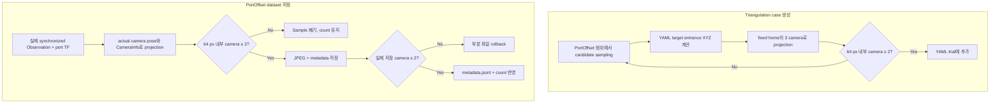

# Map Generation and Dataset Collection while ports are visible

- 작성일: 2026-08-03
- 브랜치: `feat/data_gen`
- 코드 기준: HEAD `38d0619` + 2026-08-03 working tree
- 대상: `ais/ais_triangulation/run_triangulation_cases.py`, `ais/ais_policy/data_gen_node/data_gen_node/port_offset_dataset.py`
- 결론: **Triangulation YAML은 fixed-home common-FOV를 통과한 case만 생성하고, PortOffset dataset은 실제 capture 시점에 port가 64 px margin 내부 camera 두 개 이상에서 보이는 sample만 저장한다.**

### Why?

기존 `ais_triangulation/run_triangulation_cases.py` | [generate_cases()](../src/ais/ais_triangulation/run_triangulation_cases.py#L255)는 PortOffset 범위에서 randomized YAML candidate를 만든 뒤 camera 가시성 검사 없이 모두 채택했다. 기존 로직이 Task Board 중심을 검사했던 것도 아니며, 실제 target entrance 위치를 재구성하지도 않았다. 그 결과 고정 observation pose에서도 선택된 port가 두 camera의 공통 FOV 안에 있다는 생성 단계 보장이 없었다.

Triangulation에는 같은 target을 최소 두 camera에서 관측할 수 있는 기하 조건이 필요하다. Board 중심은 rail, module, port index에 따라 달라지는 실제 target 위치를 대표하지 못하므로, YAML의 board/module/port transform을 합성한 target entrance를 camera에 직접 투영하고 조건을 통과한 candidate만 채택하도록 변경했다. 이 필터는 기하학적 FOV만 보장하며 YOLO 검출 성공까지 보장하지 않는다.

Triangulation YAML의 사전 filter는 PortOffset dataset 저장에는 적용되지 않는다. PortOffset에는 실제 capture 시점의 port projection을 검사하는 별도 runtime gate가 이미 있었지만 기본값은 한 camera와 8 px margin이었다. Dataset에도 multi-camera 학습 조건을 적용하기 위해 기본 승인 조건을 두 camera와 64 px margin으로 강화했다.

### What I Made

#### 1. Robot observation pose 고정

기존 PortOffset generator는 robot home joint마다 기본 ±4 deg noise를 적용했다. Camera pose가 case마다 달라지면 하나의 camera common-FOV 영역을 정의할 수 없으므로 triangulation runner에서는 `BASE_ROBOT_HOME`을 고정하고 `--robot-joint-noise-deg 0`만 허용한다.

Task Board, target module rail, module yaw, cable pose randomization은 기존 PortOffset 범위를 유지한다.

#### 2. YAML만으로 실제 target entrance 계산

기존 generator에는 가시성 검사가 없었다. 새 필터는 Board 중심을 근사값으로 사용하는 대신, task가 가리키는 실제 entrance frame의 위치를 계산한다.

```text
# ais_triangulation/run_triangulation_cases.py | target_entrance_in_base()
SFP:
world
→ task_board.pose
→ nic_card_mount_{rail}
→ nic_card_link
→ sfp_port_{index}_link
→ sfp_port_{index}_link_entrance

SC:
world
→ task_board.pose
→ sc_port_{rail}
→ sc_port_base_link
→ sc_port_base_link_entrance
```

코드의 핵심 합성은 다음과 같다.

```python
# ais_triangulation/run_triangulation_cases.py | target_entrance_in_base()
T_world_target = (
    T_world_board
    @ T_board_module
    @ T_module_port
    @ T_port_entrance
)

p_base = inverse(T_world_base) @ T_world_target @ [0, 0, 0, 1]
```

이 계산에는 다음 asset 값을 그대로 사용했다.

- `task_board.urdf.xacro`의 NIC/SC rail 위치
- `NIC Card Mount/model.sdf`의 card, SFP port, entrance 위치
- `SC Port/model.sdf`의 base와 entrance 위치
- `aic_gz_bringup.launch.py`의 robot world spawn pose

#### 3. 고정 home의 camera projection

`BASE_ROBOT_HOME`에서 확장한 `ur_gz.urdf.xacro` joint chain으로 다음 transform을 산출했다.

```text
# ais_triangulation/run_triangulation_cases.py | target_camera_projections()
T_base_left_optical
T_base_center_optical
T_base_right_optical
```

Camera model은 simulator의 `basler_camera_macro.xacro`와 동일하다.

| 항목 | 값 |
|---|---:|
| Image width | 1152 px |
| Image height | 1024 px |
| Horizontal FOV | 0.8718 rad |
| Near/Far clip | 0.07 / 20 m |
| 기본 border margin | 64 px |
| 기본 최소 camera 수 | 2 |

각 camera에서 target을 다음과 같이 투영한다.

```text
# ais_triangulation/run_triangulation_cases.py | target_camera_projections()
p_camera = inverse(T_base_camera) · p_base

fx = fy = width / (2 · tan(horizontal_fov / 2))
u = fx · X / Z + width / 2
v = fy · Y / Z + height / 2
```

한 camera의 가시성 조건은 다음과 같다.

```text
# ais_triangulation/run_triangulation_cases.py | target_camera_projections()
0.07 ≤ Z ≤ 20
64 ≤ u < 1088
64 ≤ v < 960
```

`left`, `center`, `right` 중 이 조건을 만족하는 camera가 기본 두 개 이상이어야 candidate를 채택한다.

#### 4. Rejection sampling

PortOffset 범위에서 candidate를 뽑은 뒤 common-FOV 조건을 통과한 case만 결과 YAML에 추가한다.

```python
# ais_triangulation/run_triangulation_cases.py | generate_cases()
for case_index in range(num_cases):
    for attempt in range(10_000):
        candidate = make_trial_config(...)
        projections = target_camera_projections(candidate)
        if visible_camera_count(projections) >= min_visible_cameras:
            accept(candidate)
            break
    else:
        raise RuntimeError("failed to sample a common-FOV case")
```

같은 `seed`와 옵션은 rejection 순서까지 같으므로 결과가 재현된다. `--sim-arg robot_x=...` 등으로 robot world pose를 변경하면 같은 값을 target의 `world → base_link` 변환에도 반영한다.

#### 5. 실행 방법

```bash
cd /home/swlinux/Desktop/workspace/AIC_Sejong/ws_aic/src

pixi run python ais/ais_triangulation/run_triangulation_cases.py \
  --seed 30 \
  --num-cases 20 \
  --robot-joint-noise-deg 0 \
  --min-visible-cameras 2 \
  --visibility-margin-px 64 \
  --generate-only
```

**세 camera 모두에 target이 들어오는 case만 허용**하려면 `--min-visible-cameras 3`을 사용한다. Margin을 크게 만들수록 image 경계에서 멀어지지만 rejection 횟수가 증가한다.

#### 6. 검증 결과

| 검증 | 결과 |
|---|---|
| Triangulation 회귀 테스트 | 20 passed |
| Seed 30, SFP/SC 20 cases 생성 | 성공 |
| 20 cases의 camera 조합 | 19건 left-center-right, 1건 center-right |
| 100 randomized cases common-FOV assertion | 전부 camera 2개 이상 |
| YAML asset transform과 smoke simulator GT 비교 | XYZ 각 축 1 µm 이내 |
| PortOffset timestamp/save 회귀 테스트 | 11 passed |
| PortOffset CLI visibility 기본값 | `2 cameras`, `64 px` 확인 |

Smoke case `trial_0000_sfp`에 대해 YAML asset chain으로 계산한 값과 evaluator가 저장한 simulator GT는 다음과 같다.

| 좌표계 | X (m) | Y (m) | Z (m) |
|---|---:|---:|---:|
| 계산값 | -0.46089224 | 0.26320389 | 0.17927232 |
| Simulator GT | -0.46089223 | 0.26320387 | 0.17927240 |

#### 7. PortOffset dataset runtime visibility gate

Triangulation은 simulator 시작 전 YAML과 fixed-home transform으로 candidate를 검사한다. PortOffset dataset node는 simulator가 실행된 뒤 실제 sample의 `ControllerState`, `CameraInfo`, image 크기와 port TF를 사용한다. 따라서 robot과 camera의 실제 capture 상태가 저장 승인에 반영된다.

```text
# ais_policy/data_gen_node/data_gen_node/port_offset_dataset.py | _port_projection_for_camera()
# ais_policy/data_gen_node/data_gen_node/port_offset_dataset.py | _save_xyz_rpy_sample()
synchronized Observation + port TF
  actual camera extrinsic + CameraInfo K
  port center pixel/depth 계산
  64 px margin 내부 visible camera 수 계산
  visible cameras >= 2 이면 JPEG + metadata 저장
  조건 미달이면 sample 폐기, 저장 count 유지
```

Dataset node의 함수별 현재 동작은 다음과 같다.

| 파일 위치 | 함수 | 역할 |
|---|---|---|
| `ais_policy/data_gen_node/data_gen_node/PortOffsetCollect.py` | [PortOffsetCollect.__init__()](../src/ais/ais_policy/data_gen_node/data_gen_node/PortOffsetCollect.py#L77) | 입력: `AIC_RPY_MIN_VISIBLE_CAMERAS`, `AIC_RPY_VISIBILITY_MARGIN_PX` 환경변수<br>처리: 기본값을 camera 2개와 64 px로 초기화<br>결과: runner 없이 policy를 직접 실행해도 같은 기본 승인 조건 사용 |
| `ais_policy/data_gen_node/data_gen_node/port_offset_dataset.py` | [_observation_sync_metadata()](../src/ais/ais_policy/data_gen_node/data_gen_node/port_offset_dataset.py#L146) | 입력: left/center/right Image와 ControllerState timestamp<br>판정: center 기준 camera span과 controller 차이가 기본 30 ms 이내인지 검사<br>결과: 실패 Observation은 visibility 계산과 파일 저장 전에 거부 |
| `ais_policy/data_gen_node/data_gen_node/port_offset_dataset.py` | [_port_projection_for_camera()](../src/ais/ais_policy/data_gen_node/data_gen_node/port_offset_dataset.py#L79) | 입력: 실제 Observation, camera 이름, base-link 기준 port TF<br>판정: actual camera extrinsic과 CameraInfo K로 depth·pixel·margin 계산<br>결과: camera별 `visible`, `u_px`, `v_px`, `depth_m` metadata 반환 |
| `ais_policy/data_gen_node/data_gen_node/port_offset_dataset.py` | [_save_xyz_rpy_sample()](../src/ais/ais_policy/data_gen_node/data_gen_node/port_offset_dataset.py#L311) | 입력: timestamp gate를 통과한 Observation, port/plug TF와 label<br>판정: visible camera 수와 실제 JPEG·metadata write 성공 수가 각각 최소값 이상인지 검사<br>결과: 성공 시에만 `metadata.jsonl`과 count 반영, 실패 시 부분 파일 삭제 |
| `ais_policy/data_gen_node/data_gen_node/port_offset_dataset.py` | [_save_vision_offset_sample()](../src/ais/ais_policy/data_gen_node/data_gen_node/port_offset_dataset.py#L513) | 입력: collect stage의 기존 vision-offset 저장 호출<br>처리: 별도 저장 경로를 만들지 않고 같은 파일의 XYZ/RPY 저장 함수에 그대로 위임<br>결과: 모든 dataset sample이 동일한 timestamp·visibility·rollback gate 사용 |

Runtime gate도 target port 중심점의 기하학적 projection만 검사한다. Mesh occlusion, 조명, distortion과 YOLO confidence는 저장 승인 조건이 아니다.

### What was problem

#### 1. Board pose와 robot home이 독립 randomization됨

Task Board가 기존 범위 안에 있더라도 robot joint noise로 camera optical pose가 달라지므로 fixed common-FOV를 보장할 수 없었다.

#### 2. Task Board 중심 검사는 적절한 대체 조건이 아님

기존 로직이 Board 중심을 검사한 것은 아니지만, 이를 단순한 가시성 조건으로 추가하는 것만으로는 충분하지 않다. 같은 board pose에서도 NIC rail 0~4, SFP port 0/1, SC rail 0/1과 rail translation에 따라 target entrance가 달라진다. 따라서 Board 중심이 FOV 안에 있어도 rail 끝의 port는 화면 밖으로 나갈 수 있다.

#### 3. Randomization 범위 자체가 가시성 조건은 아님

`x/y/yaw`가 허용 범위에 있다는 사실은 camera pixel 범위를 만족한다는 뜻이 아니다. World 좌표의 3D 범위와 camera optical frame의 frustum을 직접 교차시켜야 한다.

#### 4. 기하학적 FOV와 detection 성공은 다름

현재 필터가 보장하는 대상은 **entrance 중심점의 pinhole projection**이다. 다음 항목은 보장하지 않는다.

- 다른 mesh에 의한 가림
- 조명과 material 영향
- lens distortion
- port 전체 bbox가 image 안에 포함되는지 여부
- YOLO confidence threshold 통과

따라서 이 필터를 통과했다는 사실을 “YOLO가 반드시 검출한다”로 해석하면 안 된다. 실제 detection 보장은 simulator 시작 후 YOLO 결과를 확인하는 runtime gate가 추가로 필요하다.

#### 5. Triangulation 사전 filter만으로 dataset sample을 승인할 수 없음

Triangulation filter는 fixed home과 YAML asset transform을 사용한다. PortOffset 수집은 robot joint randomization과 port-local offset 이동 뒤 image를 저장하므로 실제 capture camera pose가 달라질 수 있다. Dataset 저장 여부는 사전 YAML 결과를 재사용하지 않고 실제 Observation에서 다시 계산해야 한다.

기존 PortOffset runtime gate는 이 위치에서 동작했지만 기본 조건이 한 camera와 8 px margin이라 multi-camera 학습 조건보다 약했다. 기본값을 두 camera와 64 px로 통일하되, CLI override 기능은 유지했다.

### How it changed



함수별 핵심 변경은 다음과 같다.

| 파일 위치 | 함수 | 변경 요약 |
|---|---|---|
| `ais_triangulation/run_triangulation_cases.py` | [target_entrance_in_base()](../src/ais/ais_triangulation/run_triangulation_cases.py#L142) | 이전: YAML target의 실제 entrance 좌표를 계산하지 않음<br>변경: board, module, port asset transform을 합성해 base-link XYZ 계산<br>효과: Board 중심이 아닌 선택된 port 자체를 가시성 검사 |
| `ais_triangulation/run_triangulation_cases.py` | [target_camera_projections()](../src/ais/ais_triangulation/run_triangulation_cases.py#L200) | 이전: candidate의 camera projection과 FOV 판정 없음<br>변경: fixed-home extrinsic과 camera model로 pixel, depth, margin 판정<br>효과: camera별 target entrance 가시성을 생성 전에 확인 |
| `ais_triangulation/run_triangulation_cases.py` | [generate_cases()](../src/ais/ais_triangulation/run_triangulation_cases.py#L255) | 이전: 생성된 candidate를 조건 검사 없이 모두 채택<br>변경: 최소 camera 수를 만족할 때까지 최대 10,000회 재추출<br>효과: common-FOV를 통과한 case만 YAML에 포함하고 실패는 명시적 종료 |
| `ais_triangulation/run_triangulation_cases.py` | [_robot_spawn_from_sim_args()](../src/ais/ais_triangulation/run_triangulation_cases.py#L232) | 이전: robot pose override가 simulator에만 전달되어 가시성 계산과 분리<br>변경: 여섯 world pose override를 읽어 target의 world-to-base 변환에 적용<br>효과: 생성 단계와 실제 simulator robot pose를 동일하게 유지 |
| `ais_triangulation/run_triangulation_cases.py` | [parse_args()](../src/ais/ais_triangulation/run_triangulation_cases.py#L380) | 이전: robot joint noise 기본 ±4 deg, 가시성 option 없음<br>변경: joint noise를 0으로 제한하고 최소 camera 수와 margin 검증 추가<br>효과: fixed-home projection 가정이 CLI 입력으로 깨지는 것을 차단 |
| `ais_triangulation/run_triangulation_cases.py` | [write_cases()](../src/ais/ais_triangulation/run_triangulation_cases.py#L322) | 이전: seed, case 수, 첫 random robot pose만 header에 기록<br>변경: fixed robot home과 camera 수, margin 조건을 header에 기록<br>효과: 생성 YAML만으로 common-FOV 조건과 재현 설정 확인 가능 |

Dataset 저장 조건 변경은 다음과 같다.

| 파일 위치 | 함수 또는 설정 | 변경 요약 |
|---|---|---|
| `ais_auto_capture/portoffset_randomization/constants.py` | [CLI_DEFAULTS](../src/ais/ais_auto_capture/portoffset_randomization/constants.py#L41) | 이전: 최소 1 camera, border margin 8 px<br>변경: 최소 2 cameras, border margin 64 px<br>효과: 별도 CLI 없이 실행해도 multi-camera sample만 승인 |
| `ais_policy/data_gen_node/data_gen_node/PortOffsetCollect.py` | [PortOffsetCollect.__init__()](../src/ais/ais_policy/data_gen_node/data_gen_node/PortOffsetCollect.py#L77) | 이전: 환경변수가 없으면 1 camera와 8 px fallback<br>변경: fallback을 2 cameras와 64 px로 통일<br>효과: runner와 policy 직접 실행의 기본 동작 일치 |
| `ais_policy/data_gen_node/data_gen_node/port_offset_dataset.py` | [_save_xyz_rpy_sample()](../src/ais/ais_policy/data_gen_node/data_gen_node/port_offset_dataset.py#L311) | 이전: runtime visibility와 rollback gate는 이미 존재<br>변경: 함수 구현은 유지하고 강화된 기본값을 입력으로 사용<br>효과: 조건 미달 sample은 JPEG·metadata·count에 포함되지 않음 |

Camera asset, robot kinematics, fixed home joint 또는 Task Board asset transform이 변경되면 `FIXED_HOME_CAMERA_OPTICAL_IN_BASE`와 target transform 상수를 함께 갱신해야 한다. PortOffset runtime gate는 actual Observation을 사용하므로 별도 fixed-home 상수 갱신은 필요 없지만 CameraInfo와 tool-camera extrinsic이 정확해야 한다.
